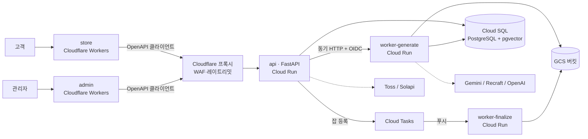

# ARCHITECTURE — essesion: YeongSeon × seamless-tile GCP 통합 재구현

> 뼈대(skeleton) 문서. 세부 설정값·코드 수준 설계는 다루지 않는다.

## 0. 대원칙

| 구분 | 내용 |
|---|---|
| **전부 새로 작성** | 프론트(store/admin), API 레이어, 워커, 배관 일체(Auth·인가·DB 연결·Storage), 그리고 **DB 스키마(기존 스키마 검토 후 재설계)**. 기존 코드 이식 금지 |
| **그대로 보존** | 비즈니스 로직·기능 명세("무엇을 하는가")와 기존 운영 데이터(새 스키마로 변환 이관) |
| **확정 제약** | api·worker=Cloud Run, 프론트=Cloudflare, DB=Cloud SQL(PostgreSQL, Enterprise), Auth=FastAPI 자체 JWT(컷오버 시 전원 재로그인) |
| **단순화 결정** | 기존 유저 전원 소셜 로그인 + 유저 수 극소 → 비밀번호 해시 이관 없음(복잡하면 신규 가입으로 전환). 이미지 소량 → Storage 자동 이관 없이 수동 재등록. env는 그대로 이전. `generate-tile`은 **완전 제거**(seamless가 그 대체재) |
| **보존 예외** | `/design` 프론트는 기획·화면 구조를 seamless 플로우에 맞춰 신규 설계 — 동작 보존 대상에서 제외 |
| **범위 밖** | 기능 개편 — "무엇을 하는가" 자체를 바꾸는 것 |

스키마 재설계가 감당 가능한 이유: 유저·이미지를 이관에서 제외(§5·§6)해 옮길 데이터가 적고, **기존→새 스키마 매핑 표**를 만들어 데이터 변환 스크립트와 동작 검증의 기준으로 삼는다.

---

## 1. 현재 상태 진단 요약

### 1.1 YeongSeon (전제 + 구조 스캔)

- pnpm workspace + Turborepo 모노레포. `apps/store`(고객), `apps/admin`(관리자), `packages/shared`, `packages/supabase`. React 19 + Vite 7 + TypeScript, TanStack Query, react-router 7.
- Supabase를 Auth·RLS·Storage·DB함수·Edge Functions에 폭넓게 사용(Realtime 미사용). 프론트가 supabase-js로 DB·Auth·Storage에 **직접 접근** → 이 층 전부가 교체 대상.
- Edge Functions 15종(최상위 디렉터리 13개 + generate-tile 서브펑션 2개 — `db/MAPPING.md`의 "13종"과 같은 대상, 계수 방식만 다름): 이미지 생성(generate-tile 계열 3종), 주문 생성 3종, 견적, Toss 결제 확정/취소, 클레임 알림, 휴대폰 인증 2종, ImageKit 업로드 인증, 만료 이미지 정리, 회원 탈퇴.
- 주요 테이블군: profiles, shipping_addresses, products(+options/likes), coupons(+user_coupons), cart_items, orders(+items), repair_shipping, claims, inquiries, custom_order_pricing, motifs, admin_settings, quote_requests, design_chat, ai_generation_logs, design_tokens, seamless_generation_logs, seamless_sessions, token_purchases, images, langgraph_checkpoint 계열.
- **중요**: 현재 YeongSeon은 seamless-tile 서비스를 HTTP로 호출하지 않는다. `/design`의 이미지 생성은 `generate-tile` 엣지 함수가 OpenAI/Google 이미지 API를 직접 호출하는데, **seamless-tile이 바로 그 대체재로 만들어진 것**이다(관리자의 `/seamless-logs`는 그 로그 뷰어). → 새 구조에서 `generate-tile` 계열은 완전 제거하고 `/design`은 seamless 워커 플로우로 연결한다.

### 1.2 seamless-tile (코드 심층 진단 — 핵심 판정)

FastAPI 서비스. prompt/intent → 결정론적 파이썬 엔진이 seamless 텍스타일 타일 SVG 생성 → 래스터화 → 업로드. 위에 대화형 편집 세션(LangGraph)과 원단 텍스처 finalize를 얹은 구조.

**컴퓨트 판정 (코드 근거)**:

| 단계 | 실체 | 부하 |
|---|---|---|
| SVG 합성 (`engine/composition.py`) | 순수 파이썬 문자열 조립(`<pattern>`+`<use>`), 배열 연산 없음, 2MB 캡 | 밀리초, 경량 |
| 지연의 주범 | Gemini(intent)·Recraft(모티프, 타임아웃 120s)·OpenAI(임베딩) 외부 HTTP | **네트워크 바운드** |
| 래스터화 (`render/raster.py`) | `rsvg-convert`/`resvg` **시스템 바이너리 서브프로세스** (pip 아님) | 중간, 컨테이너에 librsvg 설치 필요 |
| finalize (`render/fabric.py`) | Pillow 픽셀 연산 + weave PNG 타일링 + 3×3 슈퍼샘플링, 요청당 compose+래스터 4~5회 재실행 | **CPU·메모리 바운드**, 메모리는 dpi²에 비례 |

- **GPU 불필요 확정**: torch/numpy/opencv/diffusers 등 소스·requirements 어디에도 없음. 모든 "AI"는 외부 API 호출, 로컬 추론 0.
- 처리 방식은 전부 **요청 안 동기 실행** — 큐/백그라운드 워커 없음. 최악의 경우 단일 요청이 수십 초~2분 커넥션 점유.
- **멱등성은 설계상 강함**: content-hash ID, 스토리지 upsert, `(intent,seed,colorway,registry_version)` → byte-identical SVG. 단 세션 턴은 비멱등.
- 재구현 시 반드시 고칠 것: 프로세스-로컬 상태(응답 캐시·세션 락·single-flight 부재 — 수평 확장 비호환, 저자도 주석으로 인지), Pillow 등 의존성 언핀(결정론이 Pillow 버전 고정에 의존한다고 docstring이 명시하는데 언핀), 파이썬 버전 핀 없음, 앱 레벨 인증 전무, Dockerfile/CI 부재.
- DB는 Supabase Postgres 직접 DSN(psycopg3 동기): motifs pgvector 검색, 생성 로그, LangGraph checkpoint. 스키마는 YeongSeon 소유(이 레포는 read-only probe만).

---

## 2. 목표 아키텍처



| 서비스 | 위치 | 역할 | 공개 여부 |
|---|---|---|---|
| `store` | Cloudflare Workers (정적 자산) | 고객 프론트 | 공개 |
| `admin` | Cloudflare Workers (정적 자산) | 관리자 프론트 | 공개(로그인 게이트) |
| `api` | Cloud Run | 코어 API. Auth(JWT)·인가·전 도메인 비즈니스 로직·결제·과금. 기존 supabase-js 직접 접근 + Edge Functions + RLS + DB함수의 역할을 전부 흡수 | 공개 — **Cloudflare 프록시 경유**(WAF·레이트리밋·봇 차단) |
| `worker-generate` | Cloud Run | 외부-API-바운드 작업(intent 저작·모티프·candidate 생성·preview). api가 동기 HTTP + OIDC로 호출 (현재 인증 전무 문제를 경계로 해결) | 비공개 |
| `worker-finalize` | Cloud Run | CPU·메모리-바운드 작업(원단 텍스처 finalize·export). **Cloud Tasks 푸시**로 소비 — 작업 단위 재시도 제어에 적합 ([Cloud Tasks vs Pub/Sub](https://docs.cloud.google.com/tasks/docs/comp-pub-sub)) | 비공개 |

두 워커는 **한 코드베이스(`apps/worker`)를 리소스 프로파일만 달리해 두 서비스로 배포** — generate는 가볍고 동시성 높게, finalize는 메모리 크고 동시성 낮게. 부하 성격이 달라 스케일 정책을 분리한다.

프론트 배포는 Pages가 아닌 **Workers 정적 자산**으로 — 2026년 Cloudflare의 신규 프로젝트 권장 경로이며 Pages는 유지보수 모드다 ([공식 가이드](https://developers.cloudflare.com/workers/static-assets/), [React+Vite 가이드](https://developers.cloudflare.com/workers/framework-guides/web-apps/react/)). Cloudflare Vite 플러그인으로 빌드·배포. 도메인은 서브도메인으로 통일(app./admin./api.)하고 **api 서브도메인도 Cloudflare 프록시를 경유**시킨다 — WAF·레이트리밋·봇 차단·DDoS 방어를 코드 없이 확보하고, 도메인·인증서 관리가 Cloudflare 한 곳으로 모이며 CORS 구성이 단순해진다.

**관측·운영**: 전 서비스 JSON 구조화 로깅(Cloud Logging이 자동 파싱). api가 발급한 request_id를 worker 호출에 전파해 한 생성 요청을 끝까지 추적(현 seamless-tile의 request-id 미들웨어 패턴 승계). 에러 추적은 Sentry로 프론트→api→worker 전 구간 통일(프론트에서 이미 사용 중). 여기에 GCP 예산 알림 1개 + uptime check 1개 — "죽었는데 몰랐다"와 "요금 폭탄"을 막는 최소 장치. api는 **min-instances=1**로 콜드스타트를 제거(로그인 첫 요청 UX 보호), 워커 둘은 scale-to-zero 유지.

**Supabase 대체 매핑**:

| Supabase | 대체 | 비고 |
|---|---|---|
| Auth (GoTrue) | api 자체 JWT (access+refresh) + 소셜 OAuth 재구현 | 해시 이관 없음, §5 |
| RLS | api 서비스 계층 인가 (역할·소유권 검사) | 인가 모델 단순 확정 — §5 |
| Storage | GCS | 생성물은 공개 버킷+content-hash 키, 나머지는 서명 URL. 기존 객체 자동 이관 없음(소량, 수동 재등록). 이미지 서빙은 커스텀 도메인 + Cloudflare 프록시 캐시(GCS egress 절감) |
| DB 함수 / Edge Functions | api 도메인 모듈 (이미지 생성만 worker) | §4 매핑 표 |
| supabase-js 직접 쿼리 | OpenAPI 생성 클라이언트 → api | 프론트에서 DB 개념 제거 |
| Realtime | 미사용이므로 대체 불요 | — |

**워커 호출 모델 — generate는 동기, finalize는 큐**: generate는 대화형 UX(사용자가 결과를 기다림)이고 외부 API 바운드라 동기 HTTP + Cloud Run 요청 기반 오토스케일이 잘 맞는다. finalize·export는 CPU·메모리 헤비이므로 **Cloud Tasks 큐로 비동기화**하고 프론트는 잡 상태 폴링/SSE로 결과를 받는다 — `/design`이 어차피 신규 설계(보존 예외)라 비동기 UX 채택에 제약이 없다. finalize 작업은 멱등(content-hash 키)이므로 Cloud Tasks 재시도가 안전하다.

**세션 계층 — LangGraph 드롭**: 워커는 **stateless generate/finalize/export 엔진으로 한정**한다. 대화형 디자인 세션의 상태(턴 이력·선택·게이트)는 api가 일반 테이블로 소유하고, 워커는 매 호출을 단발로 처리 — langgraph 스택 의존 4종이 사라져 재구현 범위가 크게 준다. 프로세스-로컬 캐시·락도 승계하지 않는다(멱등 설계 덕에 재계산이 안전). checkpoint 테이블은 새 스키마에서 아예 만들지 않는다(§6).

---

## 3. 스택 선정 (baseline 검증 결과)

웹 검색으로 2026년 기준 재검증. **baseline 대부분 유지, 3건 갱신**(Terraform→OpenTofu, pip/poetry→uv, 코드젠 구체화).

| 영역 | 선정 | 판정 | 근거 |
|---|---|---|---|
| JS 모노레포 | **pnpm + Turborepo** (유지) | ✅ | 패키지 ~20개 이하 JS/TS 팀의 기본값. Nx는 폴리글랏 빌드·분산 CI가 필요해질 때 — 현재 규모엔 과함 ([비교](https://www.pkgpulse.com/guides/turborepo-vs-nx-monorepo-2026), [Nx 공식 비교](https://nx.dev/docs/guides/adopting-nx/nx-vs-turborepo)) |
| 프론트 | **React 19 + Vite + TanStack Query + react-router** (유지) | ✅ | 코드는 재작성하되 스택은 팀 숙련 자산 그대로. 교체 대상은 supabase-js 데이터 계층뿐 |
| API/워커 | **FastAPI + SQLAlchemy 2.0 async + asyncpg + Alembic** (유지) | ✅ | 2026년 표준 조합으로 재확인 ([TestDriven](https://testdriven.io/blog/fastapi-sqlmodel/), [async 패턴](https://oneuptime.com/blog/post/2026-01-27-sqlalchemy-fastapi/view)). 워커의 기존 psycopg3 동기 접근도 이 스택으로 통일 |
| Python 패키지 | **uv** (갱신: requirements.txt 대체) | 🔄 | 2026년 사실상 표준, uv workspace로 api·worker 공용 패키지 관리. **전 의존성 핀 + 파이썬 버전 핀**(현 seamless-tile의 언핀 문제 해소) ([비교](https://cuttlesoft.com/blog/2026/01/27/python-dependency-management-in-2026/)) |
| DB 연결 | **cloud-sql-python-connector + asyncpg** (유지) | ✅ | 비동기는 `create_async_connector`, Cloud Run에선 `refresh_strategy="lazy"` 권장 ([공식](https://github.com/GoogleCloudPlatform/cloud-sql-python-connector)) |
| 타입 코드젠 | **Hey API (@hey-api/openapi-ts) + TanStack Query 플러그인** (구체화) | 🔄 | 2026년 OpenAPI→TS 선두. TanStack Query를 이미 쓰므로 SDK+쿼리훅 생성으로 손코드 최소화 ([비교](https://dev.to/nyaomaru/which-openapi-codegen-should-you-choose-openapi-typescript-vs-hey-api-vs-orval-vs-kubb-100p), [2026 가이드](https://saschb2b.com/blog/typesafe-api-codegen-2026)). **zod 플러그인**으로 런타임 검증 스키마도 같은 소스에서 생성(프론트가 이미 zod 사용 — 이중 정의 제거) |
| IaC | **OpenTofu** (갱신: Terraform 대체) | 🔄 | 그린필드의 무후회 기본값 — 동일 HCL·프로바이더 호환, state 암호화 내장, 라이선스 모호성 없음 ([Scalr](https://scalr.com/learning-center/opentofu-vs-terraform), [Spacelift](https://spacelift.io/blog/opentofu-vs-terraform)) |
| CI/CD | **GitHub Actions** (유지) | ✅ | 빌드→테스트→이미지 푸시(Artifact Registry)→Cloud Run 배포, 프론트는 wrangler. GCP 인증은 Workload Identity Federation(키 파일 없음). Turborepo 캐시로 affected 빌드 |
| 린트/포맷/타입 | **ruff + pyright** (Python), **Biome** (JS) | ➕ | 2026 표준. 신규 코드베이스라 eslint+prettier 대신 Biome 채택 비용 0 |
| 테스트 보강 | **testcontainers**(인가 테스트), **schemathesis**(OpenAPI 퍼징) | ➕ | 인가는 실DB로 검증(§5), OpenAPI 스펙이 이미 계약이므로 설정 몇 줄로 자동 회귀 방어선 |
| OAuth 클라이언트 | **Authlib** | ➕ | 프로바이더 4종 손구현 회피, Apple client_secret JWT 함정 회피 |
| 에러 추적 | **Sentry** (api·worker 추가) | ➕ | 프론트에서 이미 사용 중 — 전 구간 통일 |
| 툴체인 버전 | **mise** | ➕ | Node·pnpm·Python·uv 버전을 루트 파일 하나로 고정 — 로컬·CI 동일 툴체인 |
| 의존성 갱신 | **Renovate** | ➕ | 전 의존성 핀 전략의 짝 — uv.lock·pnpm-lock 묶음 PR로 핀 자동 갱신 |
| 공급망 보안 | **GitHub secret scanning + push protection**, **osv-scanner**(CI) | ➕ | 켜기만 하면 되는 시크릿 유출 방지 + npm·PyPI 취약점 스캔을 단일 도구로 |
| e2e | **Playwright** — 돈 경로 스모크만 (유지) | ✅ | 기존 경험 자산. 로그인→장바구니→주문→결제(Toss 샌드박스) 한 줄기만 — e2e를 넓게 깔면 유지비가 가치를 넘는다 |
| 이미지 파이프라인 | **Pillow + librsvg(`rsvg-convert`) 서브프로세스 래스터화** | ✅ | GPU 불필요 확정이므로 CPU Cloud Run으로 충분. resvg 인프로세스화는 **동등성 판정 (b) 조건부**로 보류 — 치수·형상·색은 동일하나 도형 경계 AA가 달라 byte-identical 미달, 전환 시 fabric 골든 재베이스라인 필요(`docs/reviews/resvg-parity.md`). librsvg 서브프로세스 기준선 유지, resvg 폴백 분기 유지 |

---

## 4. 모노레포 레이아웃과 도메인 매핑

```
essesion/
├── apps/
│   ├── store/            # 고객 프론트 (재작성)
│   ├── admin/            # 관리자 프론트 (재작성)
│   ├── api/              # FastAPI 코어 API (신규)
│   └── worker/           # FastAPI 이미지 워커 (seamless-tile 재구현) — 한 코드베이스, generate/finalize 두 서비스로 배포(§2)
├── packages/
│   ├── api-client/       # Hey API 생성물 (OpenAPI → TS SDK + 쿼리훅)
│   ├── shared/           # 공용 UI·유틸 (DTO는 api-client가 대체)
│   └── tsconfig/
├── db/                   # Alembic (스키마 단일 소유처, 베이스라인 = 재설계된 새 스키마의 첫 리비전)
├── infra/                # OpenTofu (Cloud Run×3, Cloud Tasks, Cloud SQL, GCS, Artifact Registry, IAM)
├── AGENTS.md             # AI 협업 가이드 본문 (CLAUDE.md는 @AGENTS.md 임포트 한 줄로 싱크)
└── .github/workflows/    # 프론트는 wrangler로 Cloudflare 배포, api·worker는 Cloud Run 배포
```

파이썬 쪽은 uv workspace(`apps/api`, `apps/worker` + 공용 `libs/`), JS 쪽은 pnpm workspace + **catalogs**(store/admin 공유 의존성 버전을 한 곳에 선언해 드리프트 차단) — Turborepo가 양쪽 태스크를 오케스트레이션. 로컬 개발은 docker compose로 Postgres(+pgvector) 하나만 띄우고 api·worker는 uv로 직접 실행 — 클라우드 에뮬레이터류는 도입하지 않는다.

**기능 → 새 소유자 매핑** (동작 보존 명세의 골격):

| 기존 위치 | 기능 | 새 소유자 |
|---|---|---|
| supabase-js 직접 쿼리 | 상품/장바구니/주문/클레임/배송지/문의/견적/토큰내역/마이페이지 CRUD | `api` 도메인 모듈 (RLS 의미를 인가 코드로 재현) |
| Edge Fn `create-order`·`create-custom-order`·`create-sample-order` | 주문 생성 3종 | `api` orders |
| Edge Fn `confirm-payment`·`cancel-token-payment` | Toss 결제 확정/취소 | 확정은 `api` payments(+웹훅 조회 재검증 대사로 멱등 처리 — money.md §9). 취소는 `api` tokens의 환불 승인 경로(`tokens/ledger.py` — admin 승인 시 Toss cancel) |
| Edge Fn `create-quote-request` / `notify-claim` | 견적 생성 / 클레임 알림 | `api` quotes / claims |
| Edge Fn `send-phone-verification`·`verify-phone` | 휴대폰 인증 | `api` auth — Solapi(문자/카카오톡) 유지 |
| Edge Fn `imagekit-auth` / `delete-account` / `cleanup-expired-images` | 업로드 인증 / 탈퇴 / 정리 배치 | ImageKit은 **제거** — 업로드는 api가 발급하는 GCS 서명 URL로 대체. 탈퇴는 `api`, 정리 배치는 Cloud Scheduler → api 엔드포인트 |
| Edge Fn `generate-tile`(+open-api/google-api) | AI 원단 이미지 생성 + 토큰 과금 | **완전 제거** — seamless 워커가 대체. 토큰 과금·잔액 차감 로직만 `api`로 승계 |
| seamless-tile 전체 | seamless 엔진·세션·finalize·export | `worker` (재작성). `/design`의 유일한 생성 경로가 됨 |
| Supabase Storage | 생성물·업로드 파일 | GCS |

---

## 5. 인증·인가 이관

- **핵심은 소셜 OAuth 재구현**: 기존 유저 전원이 소셜 로그인이므로 **비밀번호 해시 이관은 없다**. OAuth 플로우(store의 `/auth/callback`)를 api가 **Authlib으로** 구현 — 프로바이더 4종을 손으로 구현하지 않고, Apple의 client_secret JWT 생성 같은 함정을 피한다. 프로바이더는 **Google·Kakao(현행) + Apple·Naver(추가 목표)**. Apple은 Apple Developer 계정·키·도메인 검증 등 준비물이 별도이므로 리드타임 감안.
- **기존 유저 연결은 best-effort**: 유저 수가 극소이므로, 재로그인 시 provider ID(또는 이메일)로 기존 profiles 매칭이 쉬우면 연결하고, 복잡하면 신규 가입으로 처리(주문 이력 연결 포기 — 사용자 확정).
- **개발/테스트용 id·pw 로그인 (확정)**: 운영·개발 공통으로 단순한 id/pw 로그인 엔드포인트를 하나 둔다. 단 **공개 회원가입은 없다** — 계정은 관리자 화면 또는 시드 스크립트로만 생성. store UI에는 소셜 버튼만 노출하므로 고객은 소셜만 쓰게 되고, id/pw는 로컬 테스트·운영 점검·외부인 테스트 계정 배포 용도. 해시는 처음부터 argon2id(레거시 호환 제약 없음).
- **세션**: 컷오버 시 전원 재로그인(확정 제약). JWT는 access(단명)+refresh(회전) 표준 구성.
- **인가 모델 (확정)**: RLS 원문 전수 추출은 불필요 — 규칙이 단순해서 모델로 확정한다. ① 상품(+옵션)과 찜/좋아요는 공개 조회, 쓰기는 본인만. ② 그 외 모든 리소스(주문·클레임·배송지·문의·견적·토큰·장바구니 등)는 **소유자 본인만** 접근. ③ 관리자는 별도 역할(별도 로그인)로 전체 접근. api 서비스 계층에서 이 세 규칙을 일괄 적용하고, "남의 리소스 접근 → 403" 테스트로 검증 — 이 테스트는 mock이 아닌 **실제 Postgres(testcontainers)**에서 실행한다(인가는 mock으로 검증하면 안 되는 대표 영역). 구현 중 예외 케이스가 나오면 이 모델에 비추어 판단.

---

## 6. 데이터·스토리지 이관

- **스키마 (재설계)**: 기존 스키마를 출발점으로 검토해 **새로 설계**한다 — 도메인과 데이터 의미는 그대로, 구조는 정리. generate-tile 잔재(ai_generation_logs 등)·LangGraph checkpoint 테이블·미사용 뷰는 애초에 만들지 않고, DB함수의 로직은 api로 옮긴다. 새 스키마의 첫 Alembic 리비전이 베이스라인이며 이후 모든 변경은 Alembic 경유.
- **확장**: pgvector(motifs 검색) — Cloud SQL PostgreSQL이 지원.
- **데이터 (변환 이관)**: 상품·단가·모티프 등 운영 데이터를 **기존→새 스키마 변환 스크립트**로 이관. 유저·이미지 제외(§5) 덕에 이관 대상이 적어 위험이 낮다. 기존→새 스키마 매핑 표가 변환 스크립트와 검증의 기준 문서(§0).
- **백업**: Cloud SQL 자동 백업 + **PITR(시점 복구)를 생성 시점부터 활성화** — 주문·결제 데이터가 있으므로 "잘못된 배포 직전 시각"으로 되돌릴 수단이 최소 안전장치.
- **Storage**: 자동 이관 없음 — 기존 이미지가 소량이라 운영자가 수동 재등록(사용자 확정). 신규 생성물은 GCS에 content-hash 키 + upsert 의미론(멱등성 보존).
- **env**: 기존 환경변수를 그대로 가져와 Secret Manager(api·worker)와 Cloudflare 환경변수(프론트)로 배치.
- **ImageKit 제거**: 업로드를 api가 발급하는 GCS 서명 업로드 URL로 대체하고 프론트의 @imagekit/react 의존도 없앤다 — 외부 의존 하나 제거. 이미지 서빙·캐시는 Cloudflare 프록시가 담당(§2).

---

## 7. 워커 재구현 지침 (뼈대)

- **범위**: seamless 엔진(compose/candidates/placement), 래스터화, finalize, export, 모티프 검색. 재작성이되 알고리즘 명세(결정론 계약: 같은 intent+seed → byte-identical)는 보존. `generate-tile` 계열과 세션 그래프(LangGraph)는 승계하지 않는다 — 세션 상태는 api 소유(§2).
- **stateless로**: 응답 캐시·in-flight 락·프로세스-로컬 레지스트리 지문 등은 승계하지 않는다(멱등이라 재계산 안전). 생성 예산·사용량 제한은 Postgres 공유 카운터로 정식화(프로세스-로컬 budget 락 금지). 인스턴스 수와 무관하게 동작해야 함.
- **파이프라인 재설계**: 기존 finalize(yarn_dyed)가 compose+래스터를 요청당 4~5회 재실행하던 구조는 승계하지 않는다 — 중간 산출물(베이스 SVG·마스크 래스터)을 요청 내 재사용.
- **컨테이너**: python 버전 핀 + librsvg(`rsvg-convert`) 서브프로세스 래스터화(§3 — resvg 인프로세스화는 동등성 판정 (b) 조건부로 보류, `docs/reviews/resvg-parity.md`). Pillow 포함 전 의존성 핀(uv.lock) — finalize 결정론의 전제. 번들 폰트(NotoSansCJKkr)는 **텍스트 렌더링 도입 시에만 필요** — 현 엔진·sanitize는 `<text>`를 생성·허용하지 않아 불요(점검 F5).
- **리소스 (초기 권고)**: CPU Cloud Run으로 충분(GPU 불필요 확정). `worker-generate`는 가볍게(1 vCPU / 1GB, 동시성 높게 — 지연 대부분이 외부 API 대기). `worker-finalize`는 메모리가 dpi²에 비례하므로 **2 vCPU / 4GB, 동시성 1~2, dpi 상한 600**(엔진 기본 300 유지)으로 시작하고 운영 실측 후 조정 — 1200dpi가 실제로 필요해지면 그때 8GB+로 상향.
- **경계**: 둘 다 외부 노출 없음. generate는 api의 OIDC 동기 호출, finalize는 Cloud Tasks 푸시(OIDC 토큰 포함)만 수신. 타임아웃은 Recraft 120s 재시도까지 감안해 여유 있게.

---

## 8. 마이그레이션 순서

빅뱅 컷오버(전면 재작성이므로 스트랭글러 불가)를 전제로, 병행 구축 → 리허설 → 컷오버. 실행 단위 체크리스트: [docs/CHECKLIST.md](./docs/CHECKLIST.md).

1. **골격**: 모노레포 스캐폴드 + infra(OpenTofu: Cloud Run/Cloud SQL/GCS/IAM/WIF) + Cloudflare 도메인·프록시 구성 + CI(빌드·린트·테스트·배포) + PR 프리뷰(Cloudflare 프리뷰 URL + Cloud Run 태그 리비전) + 예산 알림·uptime check. 스테이징 환경 먼저 — **별도 GCP 프로젝트로 격리**(IAM·예산·삭제가 통째로 분리되는 가장 단순한 격리).
2. **스키마 재설계**: 기존 스키마 검토 → 새 스키마 설계 + **기존→새 매핑 표** 작성 → Alembic 첫 리비전 생성. 재설계여도 도메인·데이터 의미는 보존한다(기능 개편 아님).
3. **api 1차**: Auth(JWT + 소셜 OAuth + 휴대폰 인증) → 도메인 모듈(주문·결제·토큰 등 돈 경로 우선) → OpenAPI 스펙 확정, `api-client` 코드젠 가동. 스펙·생성물은 커밋하고 **CI가 재생성 diff로 드리프트 검사** — 스펙만 바뀌고 클라이언트가 안 바뀐 채 머지되는 것을 차단.
4. **worker**: 엔진 재구현(결정론 계약 테스트로 기존과 대조 — 기존 레포의 충실한 테스트 50+개가 명세 역할) → GCS 연결 → generate(동기 OIDC)·finalize(Cloud Tasks) 두 서비스로 배포하고 api와 연결.
5. **프론트**: store/admin 재작성 — api-client만 사용, supabase-js 제거. Cloudflare Workers로 배포. `/design`은 seamless 플로우 기준으로 신규 기획·설계(보존 예외).
6. **리허설**: 스테이징에서 변환 스크립트로 운영 데이터 이관 → 주문·결제·생성 E2E 검증. 이미지 수동 재등록도 이 단계에서 수행.
7. **컷오버**: 쓰기 동결 → 변환 스크립트로 최종 운영 데이터 이관 → DNS 전환 → 전원 재로그인 공지. 롤백 플랜: DNS 원복(동결 해제 전까지 데이터 무손실).

---

## 9. 남은 확인·준비 사항

**소셜 로그인 준비물 (최우선)**
로그인 없이는 다른 기능을 테스트할 수 없다. Google·Kakao는 각 콘솔에 새 redirect URI 등록 후 api에 OAuth 엔드포인트 구현. Apple(개발자 계정·키·도메인 검증)과 Naver(앱 등록)는 준비물 리드타임이 있으므로 미리 신청.

**결제 자격증명 이전 (코드가 아니라 계정 체크리스트)**
Toss 시크릿 키 이전 + Toss 대시보드의 웹훅/콜백 URL을 새 api 주소로 갱신. Solapi API 키도 새 api의 Secret Manager로 이전. 빠뜨리면 배포 후 인증 문자·결제 확정이 조용히 실패한다.

**finalize 리소스는 초기 권고로 시작**
실제 운영 dpi가 미정이므로 §7의 초기값(2 vCPU / 4GB, 동시성 1~2, dpi 상한 600)으로 시작하고, 운영 실측(메모리 사용량·OOM 여부)을 보고 조정한다.

**워커 재구현 검증 기준**
워커의 동작 기준선은 현재 seamless-tile 레포(테스트 50여 개 포함)다. 같은 intent+seed → byte-identical SVG라는 결정론 계약을 재구현 대조 테스트로 사용.

**트랜잭션 이메일 존재 여부**
Supabase Auth가 보내던 메일(가입 확인 등)이 있었는지 **확인 필요** — 소셜 전용이라 없을 가능성이 크다. 필요해지면 Resend로 대체(2026년 기준 가장 단순한 선택).
