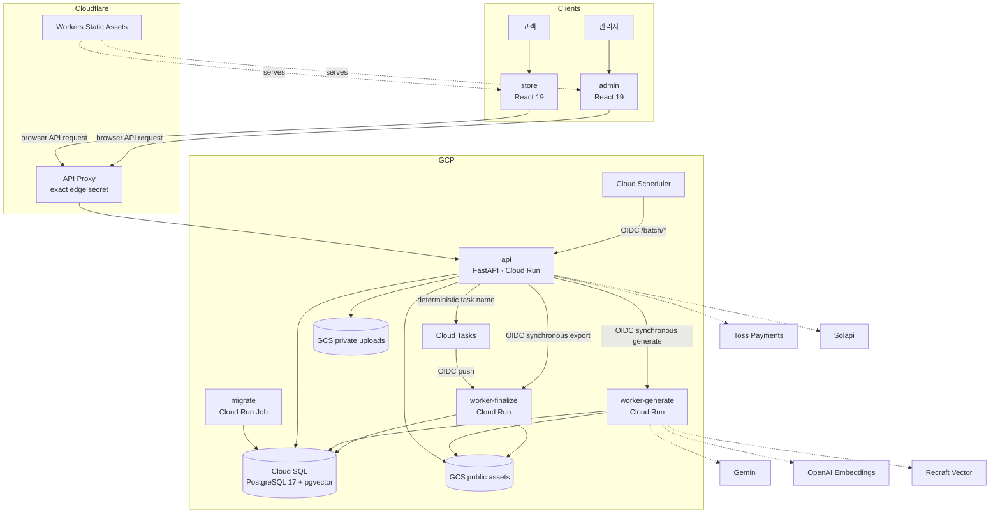
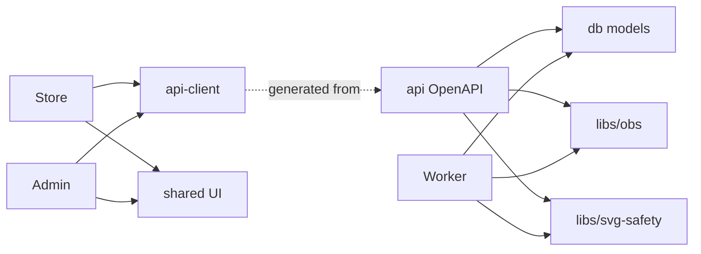
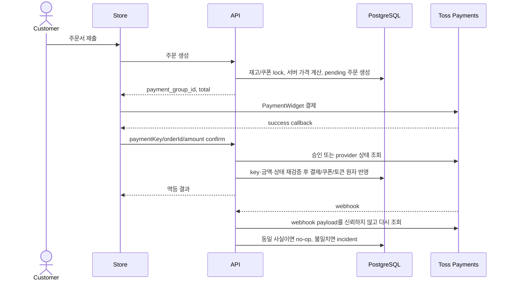
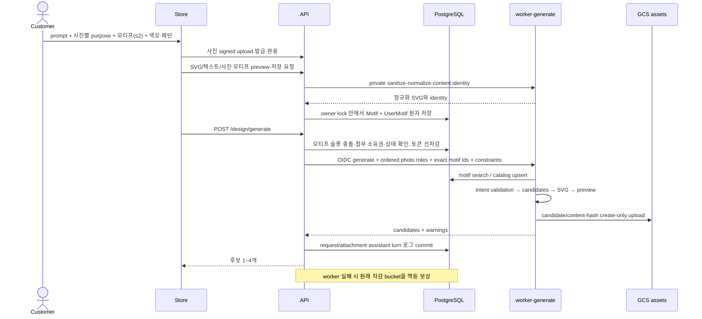
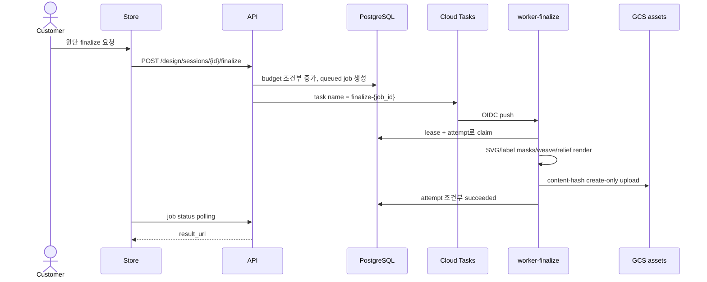
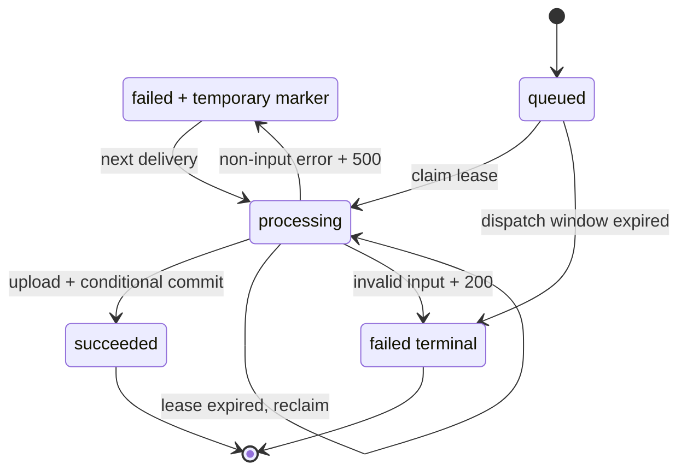

# ARCHITECTURE — ESSE SION

> YeongSeon 커머스와 seamless-tile 엔진을 통합 재구현한 현재 시스템의 **as-built architecture** 문서다. 구현된 코드, 배포 가능한 구성, 아직 외부 개통이 필요한 항목을 구분한다.

최종 갱신: 2026-07-22

## 0. 요약과 불변 원칙

ESSE SION은 고객용 커머스, 운영자 도구, 주문·결제 API, 결정론적 textile 엔진을 하나의 모노레포에서 운영하도록 재설계한 시스템이다. 핵심 경계는 다음과 같다.

```text
React clients → generated OpenAPI client → FastAPI domain API
                                             ├─ synchronous generate
                                             └─ asynchronous fabric finalize
```

### 구현 상태

| 구분 | 상태 | 의미 |
|---|---|---|
| Store·Admin·API·worker·DB | 구현·로컬 검증 완료 | 빌드, 타입 검사, 1,301개 Python/Vitest 테스트 통과 |
| OpenAPI·CI/CD·OpenTofu | 구현 완료 | codegen drift, deploy 순서, IAM·리소스 선언 검증 완료 |
| GCP·Cloudflare 스테이징 | **미개통** | 실제 `tofu apply`, DNS, WAF, Secret Manager 값 주입 필요 |
| 외부 provider 리허설 | **미완료** | Toss·Solapi·OAuth redirect·Cloud Tasks OIDC·Sentry 실연동 필요 |
| 운영 데이터 이관·컷오버 | **미완료** | 변환 검증, 개인정보 정책 승인, rollback rehearsal 필요 |

### 불변 원칙

| 원칙 | 적용 방식 |
|---|---|
| 기존 코드 이식 금지 | 모든 런타임 코드를 새로 작성하고, 도메인 의미와 동작 계약만 보존 |
| DB 변경은 Alembic만 | SQLAlchemy 모델이 정본이며 직접 DDL 실행 금지 |
| 프론트에서 DB 접근 금지 | `supabase-js` 없이 `packages/api-client`만 사용 |
| API 계약 동시 변경 | OpenAPI 변경 시 생성 클라이언트를 재생성하고 같은 커밋에 포함 |
| 돈 경로 단일 소유 | 결제·쿠폰·토큰 차감/환불은 `api` 밖에 두지 않음 |
| worker는 이미지 작업만 | 세션·과금·주문 상태는 API, SVG/래스터/fabric 계산은 worker 소유 |
| 인가 테스트에 mock 금지 | 실제 PostgreSQL testcontainer에서 익명·타인·소유자·관리자 행렬 검증 |
| 비밀값 커밋 금지 | 클라우드는 Secret Manager, 로컬은 `.env` 사용 |

### 범위

- 기존 상품·장바구니·주문·수선·맞춤/샘플·클레임·문의·견적·쿠폰·토큰 도메인의 의미를 보존한다.
- 기존 `generate-tile` 경로는 제거하고 `/design`을 seamless 엔진의 세션·후보·export·finalize 흐름으로 새로 설계한다.
- 운영 데이터 이관은 사용자와 이미지까지 자동 보존한다고 가정하지 않는다. 현재 스크립트가 구현한 사용자 독립 데이터와, 외부 결정이 필요한 사용자 종속 데이터를 구분한다.
- 프로덕션 공개, 실제 provider 자격증명 연결, 법률·개인정보 정책 승인은 이 문서의 코드 구현 범위와 별도 gate다.

---

## 1. 문제와 설계 목표

### 1.1 Before → After

| 기존 구조 | 새 구조 |
|---|---|
| 프론트가 Supabase Auth·DB·Storage·RPC에 직접 접근 | 모든 서버 통신을 생성 OpenAPI client → FastAPI로 통일 |
| RLS·DB 함수·Edge Function에 비즈니스 규칙 분산 | 서비스 계층과 명시적 트랜잭션으로 API에 집중 |
| 커머스와 이미지 서비스가 별도 저장소·배포 단위 | pnpm + uv workspace를 가진 단일 모노레포 |
| 이미지 세션·락·캐시가 프로세스 메모리에 의존 | API가 세션을 DB에 소유하고 worker는 stateless 계산 수행 |
| generate와 무거운 finalize가 같은 동기 요청 모델 | 동기 generate / Cloud Tasks 비동기 finalize 분리 |
| 단일 Storage 의미에 공개/개인 파일 혼재 | public assets / private uploads 버킷 분리 |
| prompt에서 최종 이미지까지 AI 결과에 의존 | LLM authoring과 결정론적 SVG 엔진을 분리 |

### 1.2 설계 목표

1. 커머스의 돈·권한·상태 변경을 한 트랜잭션 경계에서 설명할 수 있어야 한다.
2. 자연어 입력은 유연하되 승인된 intent 이후 결과는 재현 가능해야 한다.
3. 인스턴스가 수평 확장되거나 요청이 재시도되어도 정확성이 달라지지 않아야 한다.
4. 프론트와 API의 타입 계약이 수작업 DTO 없이 같은 OpenAPI에서 파생되어야 한다.
5. 로컬은 외부 자격증명 없이 핵심 도메인을 검증할 수 있고, 비로컬 환경은 설정 누락 시 fail-closed해야 한다.
6. 배포 가능한 상태와 실제 개통 상태를 구분해 운영 준비도를 과장하지 않아야 한다.

### 1.3 비목표

- worker 안에서 GPU 모델을 직접 추론하지 않는다. AI 호출은 외부 provider adapter를 사용한다.
- LangGraph나 범용 workflow framework를 유지하지 않는다. 현재 필요한 세션 전이는 일반 테이블과 명시적 API로 충분하다.
- 모든 작업을 비동기화하지 않는다. 사용자가 결과를 기다리는 generate와 작은 export는 동기 경로가 더 단순하다.
- 기존 운영 데이터 전체를 한 번에 자동 이관한다고 약속하지 않는다.
- 로컬 인프라는 PostgreSQL 17 + pgvector와 fake-gcs-server(파일 스토리지) 둘만 실행한다. 그 밖의 GCP·Cloudflare 서비스는 에뮬레이터 없이 DryRun/fail-closed로 다룬다.
- 스테이징 지표 없이 성급하게 resvg로 렌더러를 교체하거나 리소스 값을 최적화하지 않는다.

---

## 2. 런타임·배포 아키텍처

### 2.1 컨테이너 구성



### 2.2 서비스 책임

| 서비스 | 배포 단위 | 책임 | 외부 노출 |
|---|---|---|---|
| `store` | Cloudflare Workers Static Assets | 고객 커머스·디자인 UI | 공개 |
| `admin` | Cloudflare Workers Static Assets | 운영·복구·콘텐츠 관리 UI | 공개 URL, 로그인/역할 gate |
| API proxy | Cloudflare Worker | API origin 고정, edge secret 덮어쓰기, 보안 헤더/WAF 경계 | 공개 |
| `api` | Cloud Run | Auth, 인가, 도메인 CRUD, 주문·결제·토큰, 디자인 세션·잡 | Cloudflare를 통해 공개 |
| `worker-generate` | Cloud Run | prompt authoring, motif resolve, 후보 SVG/preview | IAM private, API만 호출 |
| `worker-finalize` | Cloud Run | fabric finalize, PNG/TIFF export, task 소비 | IAM private, API/Cloud Tasks만 호출 |
| `migrate` | Cloud Run Job | 배포 전 Alembic upgrade | 운영 파이프라인 내부 |

두 worker 서비스는 같은 `apps/worker` 이미지에서 `SERVICE_MODE=generate|finalize`로 라우트 표면을 나눈다. 코드 중복 없이 IAM, timeout, CPU·메모리, 동시성을 독립 조정하기 위한 선택이다.

프론트는 Cloudflare Vite 플러그인을 사용하지 않는다. 일반 Vite build 결과를 각 앱의 `wrangler.jsonc`로 Workers Static Assets에 배포한다.

### 2.3 트래픽과 공개 경계

- 비로컬 일반 API 요청은 Cloudflare proxy가 덮어쓰는 **정확한 edge secret** 없이는 403이다.
- 예외는 프로세스 liveness용 `/healthz`와 Google OIDC로 별도 검증하는 `/batch/*`다.
- `/readyz`는 예외가 아니다. 공개 Cloudflare 경로에서는 secret이 주입되어 응답하지만 `run.app` 직통은 403이어야 한다.
- Toss webhook과 OAuth callback의 외부 등록 주소는 `api.essesion.shop`만 사용하고 `run.app` URL을 노출하지 않는다.
- Admin mutation은 JWT role뿐 아니라 허용된 exact Origin을 검사하고 응답을 `no-store`로 제한한다.
- worker는 `roles/run.invoker`와 audience가 맞는 Google OIDC token만 수신한다.
- `/design/ideas`는 API 인스턴스 내에서 인증 사용자별 60초에 6회를 제한한다. 이 메모리 제한은 수평 확장 전체의 전역 quota가 아니므로, 프로덕션은 Cloudflare에서 같은 경로의 IP 기반 rate limit과 WAF를 추가한다. 두 제한은 defense-in-depth이지 사용자별 정확한 전역 호출량을 보증하는 과금 quota가 아니다.

### 2.4 Supabase 대체 관계

| 기존 역할 | 현재 소유자 |
|---|---|
| GoTrue Auth | FastAPI JWT(access + rotating refresh), Google·Kakao OAuth |
| RLS | API 서비스 계층의 공개/소유자/관리자 인가 행렬 |
| 직접 테이블 쿼리 | 생성 OpenAPI client → API 도메인 서비스 |
| DB 함수·Edge Functions | API 트랜잭션과 provider integration |
| Storage | GCS public assets + private uploads |
| generate-tile | deterministic seamless worker |
| LangGraph checkpoint | `design_sessions`, `design_session_turns`, `generation_jobs` |
| Realtime | 기존 미사용이므로 대체 없음 |

새 런타임에는 Supabase SDK 의존이 없다. 단, 컷오버 전 데이터 변환 스크립트는 읽기 원본으로 기존 Supabase DSN을 사용할 수 있으며 기존 프로젝트 해지는 프로덕션 안정화 이후다.

---

## 3. 기술 선택과 리소스 모델

### 3.1 실제 구현 스택

| 영역 | 선택 | 선택 이유 |
|---|---|---|
| JS workspace | pnpm 10 + Turborepo 2 | store/admin/shared/api-client의 동일 태스크 오케스트레이션과 catalog 버전 공유 |
| Frontend | React 19, Vite 8, React Router 8, TanStack Query 5 | CSR 커머스와 명시적 서버 상태/라우트 경계 |
| UI | Tailwind CSS 4 + `packages/shared` | semantic token과 공용 primitive를 앱 간 단일 정본으로 유지 |
| Python workspace | Python 3.13 + uv | api·worker·DB·공용 라이브러리 lockfile 설치 |
| Server | FastAPI + SQLAlchemy 2 async + asyncpg | OpenAPI 생성과 비동기 DB/provider I/O |
| Schema | Alembic | 모델과 revision의 리뷰 가능한 변경 이력 |
| DB | PostgreSQL 17 + pgvector | 트랜잭션 커머스와 motif vector search를 한 저장소에서 처리 |
| API codegen | Hey API | fetch SDK와 TanStack Query options를 OpenAPI에서 동시 생성 |
| Raster | librsvg subprocess + Pillow | 기존 골든과의 렌더 기준선, fabric 합성 |
| IaC | OpenTofu | GCP 리소스, IAM, monitoring, scheduler를 코드로 선언 |
| Delivery | GitHub Actions + WIF | 장기 GCP key 없이 CI 성공 SHA만 배포 |

Cloud SQL 접속에는 `cloud-sql-python-connector`를 사용하지 않는다. Cloud Run에 Cloud SQL volume을 `/cloudsql`로 mount하고 asyncpg가 Unix socket URL로 접속한다.

의존성 선언은 호환 범위를 가질 수 있지만 실제 설치 재현성은 `pnpm-lock.yaml`과 `uv.lock`이 보장한다.

### 3.2 Cloud Run 리소스

| 서비스 | CPU / Memory | Request concurrency | Timeout | Scaling |
|---|---:|---:|---:|---|
| `api` | 1 vCPU / 512 MiB | 20 | platform default | min=`api_min_instances`, max=10 |
| `worker-generate` | 1 vCPU / 1 GiB | 2 | 300s | min=0, max=10 |
| `worker-finalize` | 2 vCPU / 4 GiB | 2 | 900s | min=0, max=5 |

- 스테이징의 `api_min_instances` 기본값은 0이다. 프로덕션에서는 첫 로그인·API 요청의 cold start를 줄이기 위해 1을 적용할 계획이다.
- generate는 외부 API 대기가 크지만 요청당 preview 렌더를 최대 2개 병렬 수행하므로 인스턴스 concurrency도 2로 제한한다.
- finalize 메모리는 DPI 제곱에 비례한다. 초기 상한은 600 DPI, request timeout은 900초, DB lease는 960초다.
- worker 둘은 scale-to-zero한다. 리소스 변경은 스테이징의 latency·RSS·OOM 지표를 근거로 한다.

### 3.3 툴체인과 품질 gate

- Node 22, pnpm 10, Python 3.13, uv는 `mise.toml`로 맞춘다.
- TypeScript는 Biome + `tsc`, Python은 Ruff + Pyright를 사용한다.
- Vitest는 UI/모델, pytest는 API/worker/DB, Playwright는 돈 경로와 admin smoke를 검증한다.
- Schemathesis가 OpenAPI 계약을 퍼징하고, codegen job이 생성물 drift를 검사한다.
- testcontainers가 실제 PostgreSQL 17 + pgvector에서 인가·migration·동시성 계약을 검증한다.

---

## 4. 모노레포 소유권과 도메인 경계

### 4.1 저장소 구조

```text
essesion/
├── apps/
│   ├── store/             # 고객 React 앱
│   ├── admin/             # 관리자 React 앱
│   ├── api/               # 도메인 API·외부 provider integration
│   └── worker/            # deterministic engine·render·AI adapter
├── packages/
│   ├── api-client/        # OpenAPI 생성물
│   ├── shared/            # 공용 디자인 시스템
│   └── tsconfig/
├── libs/
│   ├── obs/               # request ID·구조화 로그·Sentry 골격
│   └── svg-safety/        # SVG parsing/sanitize 공용 경계
├── db/                    # 모델·Alembic·이관 스크립트
├── infra/                 # OpenTofu·Cloudflare proxy
├── e2e/                   # Playwright smoke
└── docs/                  # 도메인 명세·감사·운영 runbook
```

### 4.2 허용 의존 방향



- `store`와 `admin`은 API 내부 모델이나 DB 패키지를 import하지 않는다.
- DTO는 `packages/shared`가 아니라 생성된 `api-client`가 소유한다.
- `api`는 worker 엔진 코드를 import하지 않고 HTTP 계약으로 호출한다.
- `worker`는 주문·결제·토큰 원장을 수정하지 않는다.
- DB 함수·트리거·뷰에 애플리케이션 규칙을 숨기지 않는다. 규칙은 API 서비스와 테스트에 둔다.

### 4.3 도메인 소유자

| 도메인 | 소유자 | 주요 경계 |
|---|---|---|
| Auth·users | API | JWT, OAuth, refresh rotation, 휴대폰 인증, 탈퇴 |
| Products·cart·coupons | API | 공개 조회, 소유자 쓰기, 재고·쿠폰 row lock |
| Orders | API | 일반·수선·맞춤·샘플 생성, 서버 가격 계산 |
| Payments | API | Toss 승인/취소/웹훅 조회 재검증, incident |
| Tokens | API | bucketed ledger, 구매·차감·환불·환불 클레임 |
| Claims·quotes·inquiries | API | owner/admin workflow, 알림 outbox |
| Design sessions/jobs | API | 세션·턴·선택·과금·잡 상태·사용량 budget |
| Pattern compute | worker | intent validation, candidates, placement, SVG, raster |
| Motif catalog | worker + API + PostgreSQL | worker의 검색·normalize·content identity, API의 private user motif 소유권·원자 저장 |
| UI system | `packages/shared` | token, primitive, component, accessibility contract |

### 4.4 기존 기능 → 새 소유자 이관

| 기존 위치 | 기능 | 새 소유자 |
|---|---|---|
| `supabase-js` 직접 쿼리 | 상품·장바구니·주문·클레임·배송지·문의·견적·토큰·마이페이지 CRUD | `api` 도메인 모듈; RLS 의미는 서비스 인가로 재현 |
| Edge Function `create-order`·`create-custom-order`·`create-sample-order` | 주문 생성 3종 | `api` orders |
| Edge Function `confirm-payment` | Toss 결제 확정 | `api` payments; provider 재조회와 멱등 대사 포함 |
| Edge Function `cancel-token-payment` | 토큰 구매 환불 | `api` tokens; 관리자 승인 시 Toss cancel과 원장 반영 |
| Edge Function `create-quote-request`·`notify-claim` | 견적 생성·클레임 알림 | `api` quotes·claims |
| Edge Function `send-phone-verification`·`verify-phone` | 휴대폰 인증 | `api` auth + Solapi |
| Edge Function `imagekit-auth`·`delete-account`·`cleanup-expired-images` | 업로드 인증·탈퇴·정리 | ImageKit 제거 후 GCS signed URL; `api` 탈퇴; Scheduler → API batch |
| Edge Function `generate-tile` 계열 | AI 원단 이미지 생성·토큰 과금 | 생성은 seamless worker로 대체; 과금·잔액은 `api` 소유 |
| seamless-tile | intent·candidate·finalize·export | 재작성한 `worker`; 세션·잡 상태는 `api` |
| Supabase Storage | 생성물·고객 업로드 | GCS public assets / private uploads |

### 4.5 주문·결제 흐름



결제 callback과 webhook은 전달 사실이 아니라 provider 조회 결과, 저장된 payment key, 결제 그룹, 총액을 함께 검증한다. advisory lock과 일관된 row-lock 순서로 취소·토큰 회수·일반 사용의 경쟁을 직렬화한다. 상세 계약은 [돈 경로 명세](./docs/api-spec/money.md)가 정본이다.

---

## 5. 인증·인가와 신뢰 경계

### 5.1 고객·관리자 인증

- access JWT는 짧게 유지하고 refresh token은 불투명 난수의 SHA-256만 DB에 저장한다.
- refresh token은 사용할 때마다 회전한다. 이미 사용한 token이 재등장하면 같은 사용자·같은 세션 종류(store/admin)의 활성 refresh token을 모두 폐기한다.
- 비밀번호 계정은 Argon2id를 사용하며 공개 회원가입이 없다. 로컬 seed·운영자 bootstrap 계정 용도다.
- 고객 UI의 소셜 로그인은 현재 **Google·Kakao** 코드 경로가 구현되어 있다.
- Apple·Naver는 provider 등록·callback·E2E가 남아 있어 현재 지원 완료로 보지 않는다.
- OAuth 이메일 계정 연결은 provider가 검증한 이메일만 허용한다.
- 운영 컷오버 시 기존 Supabase 세션은 이관하지 않고 전원 재로그인한다.

### 5.2 인가 규칙

| 리소스 | 익명 | 소유자 | 타인 | 관리자 |
|---|---:|---:|---:|---:|
| 상품·옵션 공개 조회 | 허용 | 허용 | 허용 | 허용 |
| 찜/좋아요 공개 조회 | 허용 | 허용 | 허용 | 허용 |
| 개인 장바구니·배송지·주문·클레임·문의·견적·토큰·디자인 | 401 | 허용 | 403/404 | 역할에 따라 허용 |
| 관리자 mutation | 거부 | 거부 | 거부 | admin/manager capability에 따라 허용 |

사용자가 탈퇴하는 트랜잭션과 모든 인증 mutation은 같은 사용자 advisory lock 순서를 사용한다. 삭제 직전의 stale 세션이 개인정보나 주문을 새로 만들지 못하도록 lock 아래에서 사용자 활성 상태를 다시 읽는다.

### 5.3 신뢰 경계

| 경계 | 인증/검증 |
|---|---|
| Browser → Cloudflare | TLS, CSP·보안 헤더, 개통 시 rate limit/WAF 정책 |
| Cloudflare → API | proxy가 덮어쓰는 exact edge secret |
| Customer → API domain | JWT + owner check |
| Admin → API domain | JWT role/capability + exact Origin |
| API → worker | Google OIDC audience + service account IAM |
| Cloud Tasks → finalize | queue 전용 service account OIDC |
| Scheduler → batch | audience + invoker email을 함께 검증 |
| GitHub Actions → GCP | repository ID·ref·workflow 조건이 있는 WIF |
| Runtime → Secret | 서비스별 Secret Manager IAM |

비로컬 환경은 필수 secret·audience·provider 설정이 없을 때 로컬 token이나 DryRun으로 조용히 폴백하지 않는다. `/readyz`를 503으로 만들거나 해당 mutation을 차단한다.

### 5.4 검증 방식

- 인가 matrix는 실제 pgvector PostgreSQL testcontainer를 사용한다.
- 익명 401, 타인 403/404, owner 성공, admin 성공을 도메인별 테이블 주도 테스트로 유지한다.
- refresh 재사용, OAuth unique race, 휴대폰 인증 실패 횟수·row lock, 탈퇴 경쟁을 회귀 테스트한다.
- raw provider key·민감 incident payload는 관리자 응답에서도 redaction한다.

---

## 6. 데이터·스토리지·이관

### 6.1 스키마 소유권

- `db/src/db/models/`의 SQLAlchemy 모델이 스키마 source of truth다.
- 모든 변경은 Alembic revision으로 만들고 `alembic check`로 모델 drift를 검증한다.
- 현재 스키마는 42개 모델 테이블과 단일 베이스라인 revision으로 구성되어 있다. head는 `dadd999bf858`이며 빈 PostgreSQL에서 upgrade, `alembic check`, downgrade를 검증한다. 이 수치는 구현 스냅샷이며 설계 불변값은 아니다.
- PostgreSQL enum은 `user_role`만 유지하고 나머지 상태는 text + named CHECK constraint를 사용한다.
- DB 함수·비즈니스 트리거·애플리케이션 뷰를 두지 않는다. updated timestamp와 도메인 규칙은 서비스 계층이 소유한다.
- 공개 motif와 authoring example 검색은 Vertex AI `gemini-embedding-001`의 pgvector `vector(3072)`만 사용한다.

### 6.2 데이터 그룹

| 그룹 | 예시 | 일관성 전략 |
|---|---|---|
| Identity | users, refresh sessions, phone verifications | unique + rotation/reuse detection |
| Commerce | products, options, cart, coupons, orders, items | row lock + advisory lock + server pricing |
| Money | payments, incidents, token ledger/purchases | append/compensation + provider reconciliation |
| Support | claims, inquiries, quotes, repair shipping | owner/admin workflow + snapshots |
| Design | sessions, turns/attachments, generation logs/jobs, motifs/user motifs | API state ownership + worker lease/attempt |
| Operations | settings, outbox, audit-oriented records | bounded batch + retry cursor |

### 6.3 GCS 분리

```text
public assets bucket
├── products/...       # 공개 상품 이미지
├── previews/...       # 후보 preview
└── fabric/...         # finalize 결과

private uploads bucket
├── uploads/reform_upload/...
├── uploads/repair_shipping_upload/...
├── uploads/design_reference/...
├── uploads/sample_order/...
├── uploads/quote_request/...
└── uploads/custom_order/...
```

- public assets는 URL로 조회 가능하고 worker는 `objectCreator`만 가진다.
- private uploads에는 public viewer grant가 없다. API가 짧은 signed URL을 발급하고 완료 시 크기·형식·소유권·실제 객체를 검증한다.
- worker 결과 키는 content hash를 포함하고 `if_generation_match=0`으로 생성한다. precondition 412는 동일 content-derived key의 선행 업로드로 보고 성공 처리하며 기존 객체를 다시 읽어 byte 비교하지 않는다. create-only 조건은 기존 객체 덮어쓰기를 막는다.
- finalize 결과를 주문/견적 첨부로 사용할 때 API가 public assets에서 private uploads로 create-only 복사한다.
- 현재 공개 asset URL은 GCS 직접 주소다. 별도 Cloudflare image cache proxy는 향후 선택지이며 구현 완료로 간주하지 않는다.

### 6.4 미배포 스키마 초기화 정책

아직 외부 환경에 배포하지 않았으므로 이전 revision, 데이터 변환 스크립트와 단계적 호환 경로를 유지하지 않는다. 이전 개발 스키마나 Alembic revision이 남은 환경은 애플리케이션을 중지한 뒤 해당 데이터베이스를 drop/recreate하고 단일 베이스라인을 적용한다. 테이블·컬럼별 변환이나 과거 데이터 보존은 시도하지 않는다.

스테이징과 프로덕션은 빈 Cloud SQL에 베이스라인을 적용하고 관리자·공개 motif·authoring example을 초기 입력한다. provider credential은 Secret Manager에 넣고 JWT/session/edge secret은 환경별로 새로 생성한다. `db/MAPPING.md`는 기존 도메인 의미를 검토한 설계 기록이며 실행 가능한 이관 계약이 아니다.

### 6.5 백업·보존

- Cloud SQL 선언은 자동 백업, PITR, deletion protection을 포함한다.
- migration job은 자동 재시도하지 않는다. 실패 시 서비스 배포를 중단하고 사람이 원인을 판단한다.
- 회원 탈퇴 후 주문 snapshot·클레임·견적·문의·디자인 prompt·로그·GCS·백업에 남는 역사성 개인정보의 보존 목적과 TTL은 아직 privacy owner/법률 승인이 필요하다.
- 필드별 익명화·purge와 복구 불가성 검증은 프로덕션 cutover gate다.

---

## 7. 결정론적 worker와 이미지 파이프라인

### 7.1 AI와 엔진의 경계

```mermaid
flowchart LR
    Prompt[자연어 prompt] --> Author[Gemini authoring]
    Bootstrap[gallery bootstrap<br/>25개 Plan v3] --> Active[(approved active examples)]
    Prompt --> Retrieve[Vertex embedding + pgvector RAG]
    Active --> Retrieve
    Retrieve -->|호환 후보 중 최대 3개| Author
    Photo[참고 사진 최대 5장 + 사진별 purpose] -->|검증·축소·메타데이터 제거| Author
    Controls[fixed palette + pattern constraints] -->|prompt 지시 + 결정적 보정·재검증| Intent
    UserInput[SVG / 텍스트 / 사진] -->|path·vectorize + sanitize·normalize·content hash| PrivateMotif[소유자 exact 모티프]
    Author --> Plan[typed DesignPlansV3]
    Plan -->|deterministic compiler| Intent[intent + motif specs]
    Intent --> Resolver[Motif resolver]
    Resolver -->|exact / vector / stable fallback| Catalog[(pgvector catalog)]
    Resolver -->|catalog empty or below threshold| Recraft[Recraft vector generation]
    Catalog --> Resolved[resolved intent]
    Recraft --> Resolved
    PrivateMotif -->|소유권 확인 exact ID| Resolved
    Resolved --> Validate[Validation]
    Validate --> Candidates[Candidate variation]
    Candidates --> Placement[Placement]
    Placement --> Compose[SVG composition]
    Compose --> Seam[Seam invariants]
    Seam --> Preview[PNG preview / SVG]
    Seam --> Export[PNG/TIFF export]
    Seam --> Fabric[Fabric finalize]
```



Gemini는 텍스트와 참고 사진에서 엔진 intent가 아니라 schema-constrained `DesignPlansV3`를 작성한다. Plan v3는 palette index, normalized ratio, 최대 2개 motif source와 stripe/lattice/scatter/path/point template만 표현하며 engine ID·mm·SVG·임의 point 좌표는 알지 못한다. Pydantic 모델 자체를 Vertex `response_schema`로 넘기고, 결정적 compiler가 48mm/300dpi intent와 motif sidecar를 만든다. 색만 다른 plan은 structural fingerprint로 중복 처리하며 2개 이상의 유효한 구조가 없으면 검증 오류와 함께 한 번 다시 저작한다.

기존 25개 이상 intent에서 만든 `gallery-v1` Plan v3 manifest는 최초 bootstrap 입력이다. 런타임 few-shot 정본은 운영 DB의 `authoring_examples` 중 승인되고 `active=true`인 현재 contract·embedding model 행이다. Vertex `RETRIEVAL_QUERY`와 pgvector cosine 결과를 motif 수·pattern constraint로 거른 뒤 상위 8개에서 family가 겹치지 않는 예시를 우선해 최대 3개만 prompt에 넣는다. embedding/DB 장애나 빈 active 집합은 요청을 실패시키지 않고 예시 없이 typed schema 경로를 계속한다.

모든 생성 요청은 Plan v3 경로만 사용한다. 계약·compiler·prompt revision, 선택 example ID/유사도, structural fingerprint와 오류 유형은 generation diagnostics/intent log에 남긴다. 매일 성공·선택·finalize된 결과를 승격 후보로 선별하고 fingerprint와 vector similarity로 중복 제거한다. 관리자가 승인하면 현재 embedding을 확인해 즉시 active RAG 예시가 되며, 문제 예시는 `active=false`로 즉시 제외한다. prompt와 Plan 본문은 관리자 화면에서 편집하지 않는다. 상세 절차는 `docs/specs/authoring-plan-v3.md`다.

사진의 `purpose`가 `auto`일 때만 prompt 문맥에 따라 색·분위기·레이아웃 참고 또는 모티프 영감으로 해석하고, 명시한 역할은 다른 목적으로 재해석하지 않는다. resolver는 catalog 재사용 여부를 결정하며, 필요한 경우 Recraft가 누락된 motif SVG를 생성·정규화한다. 사용자가 SVG, 텍스트 path 또는 로컬 사진 vectorize로 만든 모티프는 가장 높은 우선순위의 exact motif로 모든 후보에 사용한다. concrete motif ID가 확정된 뒤의 validation, 배치, 합성, seam 보장에는 생성형 모델의 판단이 들어가지 않는다.

참고 사진은 API가 소유권·완료 상태·MIME·바이트를 확인한 비공개 GCS 객체만 받는다. worker는 API가 발급한 allowlist signed URL만 redirect 없이 읽고, 장당 10MB·총 50MB·20M pixel을 제한한 뒤 방향 보정, 최대 2048px 축소, JPEG 재인코딩으로 메타데이터를 제거한다. 디자인 생성과 아이디어 helper는 이 재인코딩 바이트를 Gemini image part로 전송하므로, GCS가 private라는 사실만으로 외부 processor 전송이 없다고 보지 않는다. 반면 사진 모티프의 배경 분리·vectorize는 Gemini를 호출하지 않고 Pillow+VTracer CPU threadpool 내에서만 처리한다. 프로덕션 Gemini 활성화 전에 처리 지역, 학습 사용, 로그·abuse monitoring 보존, 삭제 제어, DPA와 사용자 고지를 privacy owner가 실제 계약·프로젝트 설정 기준으로 승인해야 하며, 승인 전에 provider 보존 기간을 보증하지 않는다. 아이디어 API와 private worker 사이에서는 exact motif ID로 소유권을 확인하지만 Gemini prompt에는 content-hash ID 대신 순번과 사용자 지정 이름만 전달한다.

사진 purpose와 순서는 API request, worker image part, generation/turn attachment까지 보존한다. 사용자 SVG는 worker의 기존 SVG 안전 경계와 normalize를 통과하며 계정당 100개까지 보관한다. 텍스트는 동봉 OFL font와 FontTools로 결정적 path를 만든다. 한 생성에서 최종 motif는 최대 2개이고, 사용자 모티프는 일반 retrieval·embedding 검색·registry fingerprint에서 제외되어 다른 계정 요청에 노출되지 않는다. direct intent의 private motif ID도 현재 사용자의 라이브러리 링크 또는 같은 소유자·같은 세션의 과거 SVG 첨부 이력에 한정해 허용하여, 라이브러리 삭제 뒤 기존 variation/finalize는 유지하면서 교차 사용자·교차 세션 참조를 막는다.

fixed palette는 기존 slot/default colorway 계약 안에서 모든 지정 색이 실제 layer에 쓰이도록 결정적으로 재매핑한다. pattern constraint는 사용자 표현을 lattice/half-drop/Poisson scatter, 물리 크기·간격, 고정 rotation으로 변환한다. Gemini 저작 결과와 candidate variation 뒤에 모두 제약을 재검증하며 만족할 수 없으면 조용히 무시하지 않고 constrained retry 또는 422로 끝낸다. 상세 계약과 상한은 `docs/specs/design-generation-controls.md`가 설명한다.

### 7.2 결정론 계약

byte-identical SVG의 재현 단위는 단순한 `(prompt, seed)`가 아니다.

```text
intent version
+ resolved intent
+ seed
+ colorway
+ engine version
+ motif registry/pool fingerprint
→ byte-identical SVG
```

- prompt authoring은 의도적으로 탐색적이며 동일 문장이 다른 유효 intent를 만들 수 있다.
- RNG는 요청 seed에서 만든 지역 `random.Random`만 사용한다.
- layer, motif pool, candidate 순서를 안정 정렬하고 canonical JSON/hash를 사용한다.
- scatter·variant 선택도 seed의 순수 함수이며 전역 RNG·시간·프로세스 hash에 의존하지 않는다.
- 25개 검수 intent 전체를 골든 테스트하고 대표 seed·candidate 변형을 별도로 검증한다. 대표 compose는 `PYTHONHASHSEED=0/1/12345` 서브프로세스에서 byte 동일성을 교차 검증한다.
- finalize PNG의 byte 동일성은 intent, colorway, production method, weave, material map, DPI, texture/relief strength와 동일한 renderer·Pillow·fabric asset 버전에서 성립한다. 현재 Pillow는 lockfile로 고정되지만 container의 librsvg 패키지는 별도 버전 고정이 남아 있다.

### 7.3 배치와 seamless 보장

| placement | 방식 |
|---|---|
| `lattice` | tile을 나누는 cell과 half-drop/brick offset을 torus에 열거 |
| `path_following` | 닫히는 직선·wave 경로의 실제 주기에 맞춰 motif 간격 배분 |
| `scatter` | seeded Poisson 또는 sateen 배치를 torus 거리로 계산 |
| `point_set` | 검증된 좌표를 tile 크기로 wrap |

- 대각선은 tile 경계에서 닫히는 slope로 snap한다.
- 구조화 방향 설정은 optional `fixed_rotation_deg`로 motif instance에 적용한다. 값이 없으면 canonical layout을 사용한다.
- 경계를 넘는 motif는 반대편에 clone해 양쪽 픽셀이 연결되게 한다.
- `<symbol>`에 geometry를 한 번 정의하고 `<use>`로 인스턴스를 배치한다.
- raster seam metric은 사후 보정이 아니라 이 구조의 회귀 guard다. blur로 경계를 감추지 않는다.

### 7.4 Motif resolver

1. exact private motif와 `purpose=motif` 참고 사진이 모티프 슬롯을 먼저 사용한다. exact가 하나라도 있으면 프롬프트 기반 공개 카탈로그 모티프는 추가하지 않는다.
2. 남은 슬롯이 있는 prompt 요청은 원문을 먼저 임베딩하고 `user_upload`을 제외한 공개 카탈로그 전체에서 subject/tag 완전 토큰 일치와 pgvector cosine top-5를 합친다. `scope`는 검색 하드 필터가 아니다.
3. exact token 또는 similarity `τ=0.84` 이상만 Gemini에 ID 없는 `catalog_ref` 후보로 제공한다. Gemini가 검증된 후보를 무시하면 한 번 constrained retry 후 `semantic_mismatch`로 실패한다.
4. 신뢰도 게이트를 통과한 후보가 없을 때만 Gemini semantic spec을 해석하고, 같은 정확도 우선 검색에서도 miss면 Recraft의 inline `b64_json` vector를 받아 normalize한다. embedding 미설정·실패 시에는 exact token만 허용하며 lowest-ID fallback은 없다.
5. hit의 variant group은 seed로 안정 선택한다. 새 SVG는 `scope=whole`로 sanitize·content-hash upsert하고 resolved intent에는 concrete ID만 남긴다.

공개 카탈로그의 임베딩 문서는 `subject, description, style, view, expression, tags` 순서로 만들며 scope를 제외한다. `seed_motifs.py` 뒤 `index_motif_embeddings.py --confirm-live`를 실행해 공개 행을 초기 인덱싱하고 `embedded=total`을 확인한다. `user_upload`은 인덱싱·검색·fingerprint에서 제외한다.

외부 URL을 다시 다운로드하지 않으므로 motif generation 경로에 SSRF 가능한 2차 fetch가 없다. resolver의 선택적 조회 실패는 savepoint 안에서만 롤백해 앞선 정상 write를 보존한다.

### 7.5 Generate 흐름



생성 비용은 API가 먼저 차감하고, 실패 시 실제 차감 행의 class·원천 주문·만료를 뒤집는 보상 행을 추가한다. 임의의 paid token을 새로 만들지 않는다. API는 worker raw exception을 공개하지 않고 안정된 오류 코드로 변환한다. 일반 prompt 생성이 성공하면 사용한 프롬프트·첨부·사진 purpose·모티프·palette·pattern·후보 수 작성 상태를 해제하고 턴 이력에 남긴다. 실패한 요청은 staging upload ID와 작성 상태를 유지해 재업로드 없이 재시도한다.

최종 모티프는 최대 2개다. exact user motif와 `purpose=motif` 사진의 합이 2를 넘으면 API가 과금 전에 `motif_input_conflict`로 거부한다. exact 1개+motif 사진 1개는 둘 다 필수이며 하나라도 최종 intent에서 빠지면 성공으로 낮추지 않는다. fixed palette와 pattern constraints는 Gemini·검색 결과보다 뒤의 결정론적 constraint 경계가 최종 권위다.

사용자 모티프 경로에서 worker는 DB 소유권을 만들지 않는다. `/motifs/import`와 텍스트·사진
preview는 순수 변환 경계로 안전한 SVG와 identity만 반환하고, API가 사용자 advisory lock과
단일 트랜잭션 안에서 `Motif(source=user_upload)` 및 `UserMotif` 링크를 저장한다. 생성형 공개
catalog의 검색·upsert는 기존 worker resolver가 계속 소유하므로 private 라이브러리와 섞이지
않는다.

`다시 만들기` variation은 선택한 기존 resolved intent에 seed를 다시 적용하는 intent reroll이다. 작성창에 대기 중인 prompt·참고 사진·exact 모티프는 variation 요청에 전송하거나 소비하지 않는다. variation에 실제 적용된 후보 수·palette·pattern만 성공 후 기본값으로 돌리고, 실패하면 모든 작성 상태를 유지한다. 사진은 세션 삭제 시 만료 처리하고, 라이브러리에서 사용자 모티프 관계를 삭제해도 이미 생성된 intent와 턴의 불변 core motif는 유지한다. 아이디어 helper는 별도 rate limit을 적용하고 디자인 토큰·turn·intent·generation log를 쓰지 않는다.

### 7.6 Finalize·export 흐름



- task create 응답이 유실되어도 같은 이름으로 재시도하며 409 `ALREADY_EXISTS`를 전달 성공으로 본다.
- worker가 이미 claim한 ambiguous enqueue는 환불/실패로 되돌리지 않는다.
- API가 전달 실패와 budget 보상을 확정한 job에 늦은 task가 도착하면 실행하지 않고 ACK한다.
- 960초 lease와 attempt 조건부 terminal write로 오래된 worker가 새 결과를 덮지 못한다.
- 잘못된 intent·weave·colorway 같은 입력 오류만 terminal 2xx로 종료한다. 그 밖의 예외는 temporary marker를 기록하고 500으로 반환해 Cloud Tasks 재전송에 맡긴다.
- `failed + temporary marker`는 다음 delivery가 즉시 다시 claim한다. 960초 lease는 `processing` 상태에서 응답이 끊긴 attempt를 회수할 때만 적용한다.
- export는 작은 동기 작업이므로 API가 worker-finalize를 OIDC로 직접 호출하고 blob을 반환한다.



### 7.7 Finalize 렌더

- 승인 candidate를 다시 합성해 source SVG를 고정한다.
- color slot별 label raster를 한 번 만들고 material mask를 파생한다.
- 번들된 7종 tileable weave를 wrap sampling으로 합성한다.
- texture strength와 relief를 적용하되 seam을 흐리는 blur는 사용하지 않는다.
- 기존 4~5회 compose/raster를 승계하지 않고 중간 산출물을 재사용해 최악 렌더 호출을 3회로 줄였다.
- `print`는 하나의 twill weave를 균일 적용하고 `material_map`을 거부한다. `yarn_dyed`만 color slot별 material map과 relief를 적용한다.

### 7.8 입력·출력 hardening

- DTD/entity, script, event handler, 외부 href, `javascript:` URL을 거부한다.
- 허용 element/attribute 목록과 `defusedxml` 기반 parsing을 사용한다.
- SVG 2MB, raster 20M pixels, placement 수, layer/palette, tile size, DPI, 외부 응답 byte에 상한을 둔다.
- NaN/Infinity와 signed-int64 범위를 벗어난 seed를 거부한다.
- raster subprocess timeout은 120초다.
- Recraft는 inline base64만 수용하며 decoded byte를 제한한다.
- preview 업로드 실패는 후보 계산까지 실패시키지 않고 URL을 비운 warning으로 강등한다.

---

## 8. CI/CD·운영·이관 순서

### 8.1 CI gate

PR과 main push에서 다음을 수행한다.

1. `pnpm codegen` 재생성 후 git drift 확인
2. Biome/harness lint, Vite production build, TypeScript typecheck, Vitest
3. Ruff check/format, Pyright, pytest + 실제 PostgreSQL testcontainers
4. Store 돈 경로와 Admin Playwright smoke
5. OSV source scan. 외부 GitHub Action은 workflow에서 full commit SHA로 고정

2026-07-13 검증 스냅샷:

- Python 651 tests, Vitest 311 tests 통과
- OpenAPI 128 paths / 147 HTTP operations, codegen drift 0
- Biome 427 files, Ruff format 222 Python files, Pyright 0 errors/warnings
- 별도 release 감사에서 OpenTofu validate, API/worker Docker build, store/admin/proxy Wrangler dry-run 통과

정확한 최신 수치는 CI가 정본이며 고정된 제품 사양으로 취급하지 않는다.

### 8.2 배포 순서

```mermaid
flowchart LR
    Push[main push] --> CI[CI success]
    CI --> Gate[same SHA 확인]
    Gate --> Build[API/worker image build]
    Build --> Registry[Artifact Registry push]
    Registry --> Check[main tip 재확인]
    Check --> Migrate[Alembic migrate job]
    Migrate --> Run[Cloud Run 3 services]
    Run --> CF[Cloudflare store/admin/proxy]
    CF --> Smoke[proxy 200 · direct 403 smoke]
```



- 배포는 같은 repository의 `push/main` CI 성공이 발생시킨 `workflow_run`만 허용한다.
- 배포 concurrency는 진행 중인 배포를 취소하지 않는 단일 queue다.
- migration 직전까지 main tip이 대상 SHA인지 확인한다.
- migration 시작이 point-of-no-return이다. 그 뒤 main이 전진해도 같은 SHA의 서비스와 프론트 배포를 끝낸다.
- migrate job은 `max_retries=0`이며 실패하면 전체 배포를 중단한다.
- WIF를 사용하며 장기 GCP service-account key 파일은 없다.

현재 workflow와 IaC가 이 순서를 구현하지만 스테이징 프로젝트에는 아직 실행하지 않았다.

### 8.3 Health·readiness·관측

| 신호 | 목적 | 실패 처리 |
|---|---|---|
| `/healthz` | 프로세스 기동·event loop 생존 | Cloud Run startup/liveness가 재시작 판단 |
| `/readyz` | API의 DB ping·연동 설정 capability, worker의 DB·GCS 확인 | 공개 uptime/deploy smoke가 503 판단, 프로세스는 재시작하지 않음 |
| request ID | browser/API/worker 요청 상관관계 | 구조화 로그와 응답 header에 전파 |
| 생성 provider 진단 | Gemini·Vertex embedding·Recraft의 stage/provider/operation/reason/status/duration | 원문 prompt·provider 응답·인증 header 없이 worker JSON 로그와 `seamless_generation_logs.diagnostics`에 기록 |
| Sentry | 예외 추적 | store·api·worker instrumentation 구현, 프로젝트/DSN은 스테이징 전 주입 |
| Budget alert | 비용 50/90/100% | OpenTofu 선언, 실제 apply 후 활성화 |
| Uptime check | Cloudflare 경유 `/readyz` | OpenTofu 선언, 실제 apply 후 활성화 |

Admin에는 현재 Sentry client가 없다. “전 프론트 구간 Sentry 통일”을 현재 완료 상태로 보지 않는다.

API readiness는 Toss·Solapi·GCS·worker·Tasks·OAuth/OIDC·secret의 설정 모드를 확인하지만 외부 provider를 모두 live ping하지는 않는다. worker readiness도 Gemini·Vertex embedding·Recraft 상태를 조회하지 않는다.

Seamless admin 상세는 worker가 반환한 `generation_log_id`로 디자인 세션의 generate turn과 연결하고, 과거 응답은 request ID와 근접 시각으로만 보완 연결한다. 선택·후속 재생성·finalize 결과는 기존 turn/job을 읽어 투영하며 별도 이벤트 테이블을 만들지 않는다.

### 8.4 배치 작업

Cloud Scheduler가 다음 bounded batch를 API `/batch/*`로 호출한다.

- 주문 자동 구매확정
- stale pending 주문 취소
- stale generation job 정리·보상
- 만료 이미지 정리

비로컬 batch는 audience와 호출 service account email을 모두 검증한다. 로컬에서만 개발 token 폴백을 허용한다.

### 8.5 이관·개통 단계

실행 상태의 정본은 [docs/CHECKLIST.md](./docs/CHECKLIST.md), 사람의 수동 순서는 [docs/OPERATOR-CHECKLIST.md](./docs/OPERATOR-CHECKLIST.md)다.

1. **코드 골격·도메인 구현 — 완료**

   모노레포, DB, API, worker, store/admin, tests, CI/IaC.

2. **스테이징 bootstrap — 미완료**

   별도 GCP 프로젝트, state bucket, target apply, secret version, 전체 apply.

3. **Cloudflare/API proxy 선개통 — 미완료**

   `api.essesion.shop` route, edge secret, WAF/rate limit, direct-origin 403 확인.

4. **스테이징 배포·provider 연결 — 미완료**

   migrate, 세 서비스, 두 프론트, Google/Kakao redirect, Toss/Solapi/GCS/Sentry/Tasks 검증.

5. **데이터 리허설 — 미완료**

   사용자 매칭 정책, 변환, 이미지 수동 등록, 금액/행/FK 대조, 개인정보 purge 검증.

6. **프로덕션 컷오버 — 미완료**

   쓰기 동결, 최종 변환, DNS 전환, 전원 재로그인, rollback rehearsal.

7. **안정화·종료 — 미완료**

   운영 관찰 후 기존 Supabase 프로젝트 해지.

DNS 원복 한 줄만으로 rollback runbook을 완료 처리하지 않는다. trigger, 승인자, DB schema 호환성, 쓰기 동결 해제 조건, 명령과 데이터 보전 검증이 있어야 한다.

---

## 9. 주요 결정과 남은 위험

### 9.1 Architecture decision record 요약

| 결정 | 선택 | 이유 / 기각한 대안 |
|---|---|---|
| BaaS 경계 | Supabase 런타임 제거 | 프론트 직접 DB 결합과 규칙 분산 제거 |
| 프론트 계약 | OpenAPI 생성 client | 손으로 작성한 DTO·hook drift 제거 |
| 세션 소유 | API 일반 테이블 | 현재 요구에 LangGraph checkpoint 복잡성이 불필요 |
| generate | 동기 HTTP | 사용자가 후보를 기다리는 interactive 작업 |
| finalize | Cloud Tasks push | 작업 단위 retry·OIDC·deadline·결정적 task 이름이 필요 |
| worker 배포 | 같은 코드, 두 서비스 | 계산 코드는 공유하고 resource/IAM/route는 분리 |
| SVG renderer | librsvg 기준선 유지 | resvg가 형상은 같지만 edge AA byte parity를 만족하지 못함 |
| Storage | public/private 두 버킷 | 공개 결과와 고객 개인정보 첨부의 IAM 경계 분리 |
| DB 연결 | Cloud SQL volume + asyncpg Unix socket | Cloud Run의 단순한 연결 경로, 별도 connector 의존 불필요 |
| AI 실행 | 외부 provider, 로컬 GPU 없음 | 로컬 엔진은 좌표·SVG·Pillow 계산이며 GPU 추론이 없음 |
| 배포 인증 | GitHub WIF | 장기 service-account key 제거 |
| IaC | OpenTofu | 스테이징/프로덕션 구성을 project 변수로 재사용 |

resvg 판정 근거는 [렌더 동등성 리뷰](./docs/reviews/resvg-parity.md)에 남긴다.

### 9.2 남은 외부 gate

| 위험/미완 | 현재 완화 | 완료 조건 |
|---|---|---|
| 실제 GCP/Cloudflare 미개통 | IaC·workflow·dry-run 검증 | 스테이징 apply와 proxy/direct smoke |
| Toss·OAuth·Solapi 실연동 미검증 | local DryRun과 adapter 테스트 | provider sandbox E2E |
| Cloud Tasks OIDC 미검증 | audience/deadline/IAM 코드와 테스트 | 실제 queue→worker 전달·retry 관찰 |
| Sentry DSN 미주입 | DSN 없으면 no-op | store/api/worker 프로젝트 생성·이벤트 확인 |
| Gemini 참고 사진 외부 처리·보존 정책 미승인 | private GCS 소유권 검증·메타데이터 제거; 로컬 사진 vectorize는 provider 미전송 | 실제 Gemini 계약·프로젝트 설정의 처리 지역·학습·로그/보존·삭제·DPA·사용자 고지 승인 |
| Apple·Naver OAuth 미구현 | Google·Kakao만 지원으로 명시 | provider 등록·callback·E2E |
| 사용자 종속 데이터 이관 정책 미확정 | migration stub과 mapping 문서 | 사용자 매칭·대조 리허설 승인 |
| 역사성 개인정보 retention 미승인 | production cutover 차단 | 필드별 TTL·purge·backup 정책 승인/검증 |
| finalize 운영 메모리 미실측 | 600 DPI, 4 GiB, concurrency 2 상한 | 스테이징 RSS/latency/OOM 측정 후 조정 |
| API/worker DB role 공유 | 서비스별 IAM과 secret access는 분리 | DB role·grant까지 최소권한 분리 |
| librsvg 패키지 버전 미고정 | 현재 환경의 fabric golden으로 회귀 감시 | base image digest와 renderer 패키지 버전 고정 |

### 9.3 설계 정본

- 전체 진행 상태: [docs/CHECKLIST.md](./docs/CHECKLIST.md)
- 개통 runbook: [docs/OPERATOR-CHECKLIST.md](./docs/OPERATOR-CHECKLIST.md)
- 기존→새 스키마: [db/MAPPING.md](./db/MAPPING.md)
- 주문·결제·토큰: [docs/api-spec/money.md](./docs/api-spec/money.md)
- worker 엔진: [docs/api-spec/worker-engine.md](./docs/api-spec/worker-engine.md)
- worker pipeline: [docs/api-spec/worker-pipeline.md](./docs/api-spec/worker-pipeline.md)
- motif resolve: [docs/api-spec/worker-motifs.md](./docs/api-spec/worker-motifs.md)
- 전체 감사: [docs/reviews/repo-refactor-2026-07.md](./docs/reviews/repo-refactor-2026-07.md)

이 문서는 시스템 경계와 결정의 정본이다. 정확한 상태 문자열, 요청 필드, 금액 공식, 운영 명령은 위 도메인 명세와 runbook을 우선한다.
