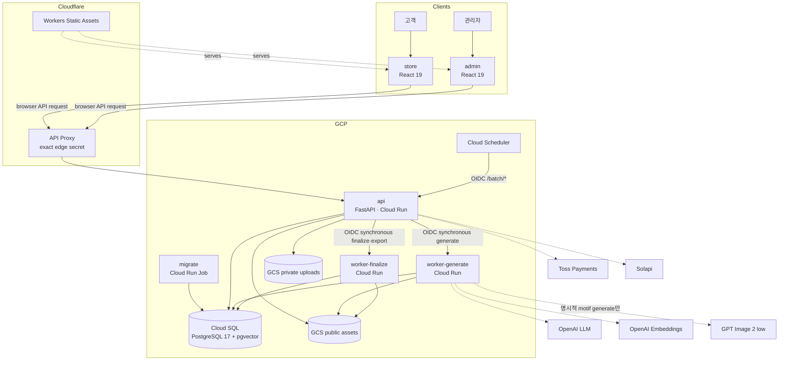
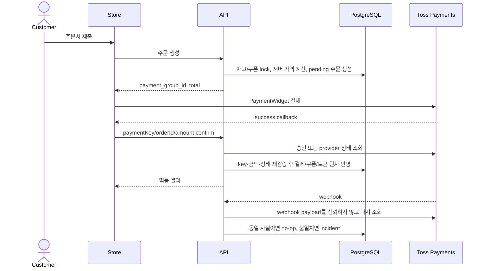

# ARCHITECTURE — ESSE SION

> YeongSeon 커머스와 seamless-tile 엔진을 통합 재구현한 현재 시스템의 **as-built architecture** 문서다.
> 시스템 경계와 설계 결정이 여기 있고, 정확한 필드·금액 공식·운영 명령은 [§8.3 설계 정본](#83-설계-정본)의 문서를 우선한다.

최종 갱신: 2026-08-14

## 0. 요약과 불변 원칙

고객용 커머스, 운영자 도구, 주문·결제 API, 결정론적 textile 엔진을 하나의 모노레포에서 운영한다.

```text
React clients → generated OpenAPI client → FastAPI domain API
                                             ├─ synchronous generate
                                             └─ synchronous fabric finalize
```

### 구현 상태

| 구분 | 상태 |
|---|---|
| Store·Admin·API·worker·DB | 구현·로컬 검증 완료 |
| OpenAPI·CI/CD·OpenTofu | 구현 완료 (codegen drift, deploy 순서, IAM·리소스 선언 검증) |
| GCP·Cloudflare production | 개통 완료 — OpenTofu no-change, proxy/direct 경계와 worker·batch OIDC 확인 |
| Production 전환 | 완료 — 새 GCP 런타임과 `essesion.shop` 연결 |

정확한 테스트·계약 수치는 CI가 정본이다. 이 문서는 고정 수치를 싣지 않는다.

### 불변 원칙

| 원칙 | 적용 방식 |
|---|---|
| 기존 코드 이식 금지 | 모든 런타임 코드를 새로 작성하고, 도메인 의미와 동작 계약만 보존 |
| DB 변경은 Alembic만 | SQLAlchemy 모델이 정본이며 직접 DDL 실행 금지 |
| 프론트에서 DB 접근 금지 | `supabase-js` 없이 `packages/api-client`만 사용 |
| API 계약 동시 변경 | OpenAPI 변경 시 생성 클라이언트를 재생성하고 같은 커밋에 포함 |
| 돈 경로 단일 소유 | 결제·쿠폰·토큰 차감/환불은 `api` 밖에 두지 않음 |
| worker는 이미지 작업만 | 세션·과금·주문 상태는 API, SVG/래스터/fabric 계산은 worker 소유 |
| 인가 테스트에 mock 금지 | 실제 PostgreSQL testcontainer에서 익명·타인·소유자·관리자 행렬 검증 |
| 비밀값 커밋 금지 | 클라우드는 Secret Manager, 로컬은 `.env` 사용 |

### 범위와 경계

- 기존 상품·장바구니·주문·수선·맞춤/샘플·클레임·문의·견적·쿠폰·토큰 도메인의 의미를 보존한다.
- 기존 `generate-tile`을 제거하고 `/design`을 seamless 엔진의 세션·스텝·export·finalize 흐름으로 새로 설계한다.
- 로컬 인프라는 PostgreSQL 17 + pgvector와 fake-gcs-server 둘만 실행한다. 나머지 GCP·Cloudflare 경계는 fail-closed다.
- **별도 staging 프로젝트를 두지 않는다.** 로컬은 코드·도메인 검증, 단일 production 프로젝트는 클라우드 런타임과 운영 데이터를 소유한다.
- 운영 데이터 이관은 사용자와 이미지까지 자동 보존한다고 가정하지 않는다.
- 운영 데이터 이관과 컷오버는 코드 구현과 별도 gate다.

---

## 1. 런타임·배포 아키텍처

### 1.1 컨테이너 구성


```mermaid
flowchart TB
    subgraph Clients
        Customer[고객]
        Operator[관리자]
        Store[store<br/>React 19]
        Admin[admin<br/>React 19]
        Customer --> Store
        Operator --> Admin
    end

    subgraph Cloudflare
        Static[Workers Static Assets]
        Proxy[API Proxy<br/>exact edge secret]
        Static -. serves .-> Store
        Static -. serves .-> Admin
        Store -->|browser API request| Proxy
        Admin -->|browser API request| Proxy
    end

    subgraph GCP
        API[api<br/>FastAPI · Cloud Run]
        Generate[worker-generate<br/>Cloud Run]
        Finalize[worker-finalize<br/>Cloud Run]
        Scheduler[Cloud Scheduler]
        Migrate[migrate<br/>Cloud Run Job]
        SQL[(Cloud SQL<br/>PostgreSQL 17 + pgvector)]
        Assets[(GCS public assets)]
        Uploads[(GCS private uploads)]

        Proxy --> API
        API -->|OIDC synchronous generate| Generate
        API -->|OIDC synchronous finalize·export| Finalize
        Scheduler -->|OIDC /batch/*| API
        Migrate --> SQL
        API --> SQL
        Generate --> SQL
        Finalize --> SQL
        API --> Assets
        API --> Uploads
        Generate --> Assets
        Finalize --> Assets
    end

    Generate -.-> LLM[OpenAI LLM]
    Generate -.-> Embedding[OpenAI Embeddings]
    Generate -.->|명시적 motif generate만| GPTImage[GPT Image 2 low]
    API -.-> Toss[Toss Payments]
    API -.-> Solapi[Solapi]
```

### 1.2 서비스 책임

| 서비스 | 배포 단위 | 책임 | 외부 노출 |
|---|---|---|---|
| `store` | Cloudflare Workers Static Assets | 고객 커머스·디자인 UI | 공개 |
| `admin` | Cloudflare Workers Static Assets | 운영·복구·콘텐츠 관리 UI | 공개 URL, 로그인/역할 gate |
| API proxy | Cloudflare Worker | API origin 고정, edge secret 덮어쓰기, WAF 경계 | 공개 |
| `api` | Cloud Run | Auth, 인가, 도메인 CRUD, 주문·결제·토큰, 디자인 세션·잡 | Cloudflare 경유 공개 |
| `worker-generate` | Cloud Run | prompt authoring, 구성 patch, catalog grounding, 명시적 motif 생성, 디자인 SVG/preview | IAM private, API만 |
| `worker-finalize` | Cloud Run | fabric finalize, PNG/TIFF export | IAM private, API만 |
| `migrate` | Cloud Run Job | 배포 전 Alembic upgrade | 파이프라인 내부 |

두 worker는 같은 `apps/worker` 이미지에서 `SERVICE_MODE=generate|finalize`로 라우트 표면을 나눈다.
코드 중복 없이 IAM·timeout·CPU/메모리·동시성을 독립 조정하기 위한 선택이다.

프론트는 Cloudflare Vite 플러그인을 쓰지 않는다. 일반 Vite build 결과를 각 앱의 `wrangler.jsonc`로 배포한다.

### 1.3 트래픽과 공개 경계

- 비로컬 일반 API 요청은 Cloudflare proxy가 덮어쓰는 **정확한 edge secret** 없이는 403이다.
- 예외는 프로세스 liveness용 `/healthz`와 Google OIDC로 별도 검증하는 `/batch/*`뿐이다.
- `/readyz`는 예외가 아니다. 공개 경로에서는 응답하지만 `run.app` 직통은 403이어야 한다.
- Toss webhook과 OAuth callback의 외부 등록 주소는 `api.essesion.shop`만 사용한다.
- Admin mutation은 JWT role뿐 아니라 허용된 exact Origin을 검사하고 응답을 `no-store`로 제한한다.
- worker는 `roles/run.invoker`와 audience가 맞는 Google OIDC token만 수신한다.
- `/design/ideas`는 API 인스턴스 내 인증 사용자별 60초 6회 제한이다. 레이트리밋 시행 지점은 여기 하나뿐이고 edge 규칙은 두지 않는다(근거: `docs/reviews/cloudflare-waf-rate-limits-2026-08-14.md`). 인스턴스별 제한이라 **전역 quota가 아니다** — 과금 quota는 토큰 원장이 담당한다.

### 1.4 Supabase 대체 관계

새 런타임에 Supabase SDK 의존은 없다. GoTrue → FastAPI JWT + OAuth 4종, RLS → API 서비스 계층
인가 행렬, DB 함수·Edge Functions → API 트랜잭션, Storage → GCS 2버킷, generate-tile → 결정론
worker, LangGraph checkpoint → `design_sessions`/`design_session_turns`/`generation_jobs`.
테이블·제약의 정본은 `db/src/db/models/`이며, 코드만으로 드러나지 않는 설계 의도는 [db/README.md](./db/README.md)에 있다.

---

## 2. 기술 선택과 리소스 모델

### 2.1 스택

| 영역 | 선택 | 선택 이유 |
|---|---|---|
| JS workspace | pnpm 10 workspaces | 재귀 태스크 실행과 catalog 버전 공유 |
| Frontend | React 19, Vite 8, React Router 8, TanStack Query 5 | CSR 커머스와 명시적 서버 상태/라우트 경계 |
| UI | Tailwind CSS 4 + `packages/shared` | semantic token과 공용 primitive를 앱 간 단일 정본으로 |
| Python workspace | Python 3.13 + uv | api·worker·DB·공용 라이브러리 lockfile 설치 |
| Server | FastAPI + SQLAlchemy 2 async + asyncpg | OpenAPI 생성과 비동기 DB/provider I/O |
| Schema | Alembic | 모델과 revision의 리뷰 가능한 변경 이력 |
| DB | PostgreSQL 17 + pgvector | 트랜잭션 커머스와 motif vector search를 한 저장소에서 |
| API codegen | Hey API | fetch SDK와 TanStack Query options를 OpenAPI에서 동시 생성 |
| Raster | librsvg subprocess + Pillow | 기존 골든과의 렌더 기준선, fabric 합성 |
| IaC | OpenTofu | GCP 리소스·IAM·monitoring·scheduler 선언 |
| Delivery | GitHub Actions + WIF | 장기 GCP key 없이 CI 성공 SHA만 배포 |

Cloud SQL 접속에 `cloud-sql-python-connector`를 쓰지 않는다. Cloud Run에 Cloud SQL volume을
`/cloudsql`로 mount하고 asyncpg가 Unix socket URL로 접속한다. 설치 재현성은 `pnpm-lock.yaml`과 `uv.lock`이 보장한다.

### 2.2 Cloud Run 리소스

| 서비스 | CPU / Memory | Concurrency | Timeout | Scaling |
|---|---:|---:|---:|---|
| `api` | 1 vCPU / 512 MiB | 20 | platform default | min=`api_min_instances`, max=3 |
| `worker-generate` | 1 vCPU / 1 GiB | 2 | 300s | min=0, max=2 |
| `worker-finalize` | 2 vCPU / 4 GiB | 2 | 240s | min=0, max=1 |

- `api_min_instances` 기본값은 비용을 위해 0이다. cold start가 실제 사업 지표를 훼손할 때만 1로 올린다.
- generate는 외부 API 대기가 크지만 요청당 preview 렌더를 최대 2개 병렬 수행하므로 concurrency도 2다.
- finalize 메모리는 DPI 제곱에 비례한다. dpi 상한 600. 동기 요청-응답이라 api 쪽 worker timeout(180초)이 상한을 정한다.
- worker 둘은 scale-to-zero한다. 리소스 변경은 production의 latency·RSS·OOM 지표를 근거로 한다.

### 2.3 툴체인과 품질 gate

- Node 22, pnpm 10, Python 3.13, uv는 `mise.toml`로 맞춘다.
- TypeScript는 Biome + `tsc`, Python은 Ruff + Pyright.
- Vitest는 UI/모델, pytest는 API/worker/DB, Playwright는 돈 경로와 admin smoke.
- Schemathesis가 OpenAPI 계약을 퍼징하고, codegen job이 생성물 drift를 검사한다.
- `pnpm architecture:check`가 모듈 경계(dependency-cruiser·import-linter)와 문서 링크를 검사한다.
- testcontainers가 실제 PostgreSQL 17 + pgvector에서 인가·migration·동시성 계약을 검증한다.

---

## 3. 모노레포 소유권과 도메인 경계

### 3.1 저장소 구조

```text
essesion/
├── apps/
│   ├── store/             # 고객 React 앱
│   ├── admin/             # 관리자 React 앱
│   ├── api/               # 도메인 API·외부 provider integration
│   └── worker/            # deterministic engine·render·AI adapter
├── packages/
│   ├── api-client/        # OpenAPI 생성물
│   ├── shared/            # 공용 디자인 시스템
│   └── tsconfig/
├── libs/
│   ├── obs/               # request ID·구조화 로그·Sentry 골격
│   └── svg-safety/        # SVG parsing/sanitize 공용 경계
├── db/                    # 모델·Alembic
├── infra/                 # OpenTofu·Cloudflare proxy
├── scripts/               # 아키텍처·문서 gate 하네스
├── tests/                 # 저장소 수준 테스트(migration 등)
├── e2e/                   # Playwright smoke
└── docs/                  # 도메인 명세·감사·운영 runbook
```

### 3.2 허용 의존 방향

`store`·`admin` → `api-client` + `shared` / `api`·`worker` → `db` + `libs/obs` + `libs/svg-safety`.
`api-client`는 api의 OpenAPI에서 생성된다. 이 방향은 `pnpm architecture:check`가 강제한다.

- `store`와 `admin`은 API 내부 모델이나 DB 패키지를 import하지 않는다.
- DTO는 `packages/shared`가 아니라 생성된 `api-client`가 소유한다.
- `api`는 worker 엔진 코드를 import하지 않고 HTTP 계약으로 호출한다.
- `worker`는 주문·결제·토큰 원장을 수정하지 않는다.
- DB 함수·트리거·뷰에 애플리케이션 규칙을 숨기지 않는다.

### 3.3 도메인 소유자

| 도메인 | 소유자 | 주요 경계 |
|---|---|---|
| Auth·users | API | JWT, OAuth, refresh rotation, 휴대폰 인증, 탈퇴 |
| Products·cart·coupons | API | 공개 조회, 소유자 쓰기, 재고·쿠폰 row lock |
| Orders | API | 일반·수선·맞춤·샘플 생성, 서버 가격 계산 |
| Payments | API | Toss 승인/취소/웹훅 조회 재검증, incident |
| Tokens | API | bucketed ledger, 구매·차감·환불·환불 클레임 |
| Claims·quotes·inquiries | API | owner/admin workflow, 알림 outbox |
| Design sessions/jobs | API | 세션·턴·스텝 활성화·과금·잡 상태·사용량 budget |
| Pattern compute | worker | intent validation, compose, placement, SVG, raster |
| Motif catalog | worker + API + PostgreSQL | worker의 검색·normalize·content identity, API의 private user motif 소유권·원자 저장 |
| UI system | `packages/shared` | token, primitive, component, accessibility contract |

### 3.4 주문·결제 흐름


```mermaid
sequenceDiagram
    actor U as Customer
    participant S as Store
    participant A as API
    participant DB as PostgreSQL
    participant T as Toss Payments

    U->>S: 주문서 제출
    S->>A: 주문 생성
    A->>DB: 재고/쿠폰 lock, 서버 가격 계산, pending 주문 생성
    A-->>S: payment_group_id, total
    S->>T: PaymentWidget 결제
    T-->>S: success callback
    S->>A: paymentKey/orderId/amount confirm
    A->>T: 승인 또는 provider 상태 조회
    A->>DB: key·금액·상태 재검증 후 결제/쿠폰/토큰 원자 반영
    A-->>S: 멱등 결과
    T-->>A: webhook
    A->>T: webhook payload를 신뢰하지 않고 다시 조회
    A->>DB: 동일 사실이면 no-op, 불일치면 incident
```

결제 callback과 webhook은 전달 사실이 아니라 provider 조회 결과, 저장된 payment key, 결제 그룹,
총액을 함께 검증한다. advisory lock과 일관된 row-lock 순서로 취소·토큰 회수·일반 사용의 경쟁을
직렬화한다. 상세 계약은 [돈 경로 명세](./docs/api-spec/money.md)가 정본이다.

---

## 4. 인증·인가와 신뢰 경계

### 4.1 인증

- access JWT는 짧게 유지하고 refresh token은 불투명 난수의 SHA-256만 DB에 저장한다.
- refresh token은 사용할 때마다 회전한다. 이미 사용한 token이 재등장하면 같은 사용자·같은 세션 종류(store/admin)의 활성 refresh token을 모두 폐기한다.
- 비밀번호 계정은 Argon2id를 사용하며 **공개 회원가입이 없다**. 로컬 seed·운영자 bootstrap 용도다.
- 소셜 로그인은 **Google·Kakao·Naver·Apple 4종이 모두 구현**되어 있다(`SUPPORTED_PROVIDERS`). Apple은 `.p8` 키로 서명한 ES256 client_secret JWT와 `response_mode=form_post` 크로스사이트 POST 콜백을 쓰므로 세션 쿠키가 비로컬에서 `SameSite=None`이다.
- 콘솔 등록이 끝나지 않은 provider는 store가 `AUTH_PROVIDERS[].comingSoon` 문구로 게이팅해 OAuth로 보내지 않는다(현재 4종 모두 개통). 서버 쪽 설정 상태는 `/readyz`의 `oauth_*` capability로 드러난다.
- 네이버는 로그인 외에 **네이버페이 배송지 1회 수입**(callback 시점, 저장 배송지 0건인 사용자만, 토큰 미저장)과 **네이버앱 자동로그인**(`auth_type=autologin`, 시도 조건은 store 판단)을 지원한다. 계약 상세는 `docs/api-spec/domains.md` §2.
- OAuth 이메일 계정 연결은 provider가 검증한 이메일만 허용한다.
- 운영 컷오버 시 기존 Supabase 세션은 이관하지 않고 전원 재로그인한다.

### 4.2 인가 규칙

| 리소스 | 익명 | 소유자 | 타인 | 관리자 |
|---|---:|---:|---:|---:|
| 상품·옵션 공개 조회 | 허용 | 허용 | 허용 | 허용 |
| 찜/좋아요 공개 조회 | 허용 | 허용 | 허용 | 허용 |
| 개인 장바구니·배송지·주문·클레임·문의·견적·토큰·디자인 | 401 | 허용 | 403/404 | 역할에 따라 허용 |
| 관리자 mutation | 거부 | 거부 | 거부 | admin/manager capability에 따라 |

탈퇴 트랜잭션과 모든 인증 mutation은 같은 사용자 advisory lock 순서를 쓴다. 삭제 직전의 stale
세션이 개인정보나 주문을 새로 만들지 못하도록 lock 아래에서 사용자 활성 상태를 다시 읽는다.

### 4.3 신뢰 경계

| 경계 | 인증/검증 |
|---|---|
| Browser → Cloudflare | TLS, CSP·보안 헤더, rate limit/WAF |
| Cloudflare → API | proxy가 덮어쓰는 exact edge secret |
| Customer → API domain | JWT + owner check |
| Admin → API domain | JWT role/capability + exact Origin |
| API → worker | Google OIDC audience + service account IAM |
| Scheduler → batch | audience + invoker email을 함께 검증 |
| GitHub Actions → GCP | repository ID·ref·workflow 조건이 있는 WIF |
| Runtime → Secret | 서비스별 Secret Manager IAM |

비로컬 환경은 필수 secret·audience·provider 설정이 없을 때 로컬 token이나 DryRun으로 조용히
폴백하지 않는다. GCS 누락은 기동을 중단하고, 그 밖의 provider 누락은 `/readyz`를
503으로 만들거나 해당 mutation을 차단한다.

검증은 실제 pgvector PostgreSQL testcontainer로 한다 — 익명 401, 타인 403/404, owner·admin 성공을
도메인별 테이블 주도 테스트로 유지하고, refresh 재사용·OAuth unique race·휴대폰 인증 시도 제한과
row lock·탈퇴 경쟁을 회귀 테스트한다. raw provider key와 민감 incident payload는 관리자 응답에서도 redaction한다.

---

## 5. 데이터·스토리지

### 5.1 스키마 소유권

- `db/src/db/models/`의 SQLAlchemy 모델이 스키마 source of truth다.
- 모든 변경은 Alembic revision으로 만들고 `alembic check`로 모델 drift를 검증한다.
- 미배포 단계이므로 리비전 체인을 최소로 유지한다. 베이스라인 `f8c3b2a19d47`에서 순차 리비전을 거쳐 head `c7a8d2f1b604`에 도달하며, 빈 PostgreSQL에서 upgrade·`alembic check`·downgrade를 검증한다.
- PostgreSQL enum은 `user_role`만 유지하고 나머지 상태는 text + named CHECK constraint를 쓴다.
- DB 함수·비즈니스 트리거·애플리케이션 뷰를 두지 않는다.
- 공개 motif와 authoring example 검색은 OpenAI `text-embedding-3-large`(dimensions=1536)의 pgvector `vector(1536)`만 쓴다.

### 5.2 데이터 그룹

| 그룹 | 예시 | 일관성 전략 |
|---|---|---|
| Identity | users, refresh sessions, phone verifications | unique + rotation/reuse detection |
| Commerce | products, options, cart, coupons, orders, items | row lock + advisory lock + server pricing |
| Money | orders의 payment key/group, payment incidents, token ledger/purchases | append/compensation + provider reconciliation |
| Support | claims, inquiries, quotes, repair shipping | owner/admin workflow + snapshots |
| Design | sessions, turns/attachments, generation logs/jobs, motifs/user motifs | API state ownership + worker lease/attempt |
| Operations | settings, outbox, admin operation logs | bounded batch + retry cursor |

### 5.3 GCS 분리

```text
public assets bucket
├── products/...                          # 공개 상품 이미지
├── previews/{request_id}/{design_id}/...  # 디자인 preview
└── fabric/...                            # finalize 결과

private uploads bucket
└── uploads/{reform_upload|repair_shipping_upload|design_reference|sample_order|quote_request|custom_order}/...
```

- public assets는 URL로 조회 가능하고 worker는 `objectCreator`만 가진다.
- private uploads에는 public viewer grant가 없다. API가 짧은 signed URL을 발급하고 완료 시 크기·형식·소유권·실제 객체를 검증한다.
- worker 결과 키는 content hash를 포함하고 `if_generation_match=0`으로 생성한다. precondition 412는 동일 content-derived key의 선행 업로드로 보고 성공 처리한다.
- finalize 결과를 주문/견적 첨부로 쓸 때 API가 public assets에서 private uploads로 create-only 복사한다.
- 공개 asset URL은 GCS 직접 주소다. Cloudflare image cache proxy는 향후 선택지이며 구현 완료가 아니다.
- local/test는 설정이 비면 `http://localhost:4443`의 `dev-uploads`·`dev-assets`를 쓴다. 비로컬은 두 버킷 중 하나라도 빠지면 기동하지 않는다.

### 5.4 초기화·백업

아직 외부 배포가 없으므로 이전 개발 데이터의 단계적 호환 경로를 유지하지 않는다. 이전 스키마가
남은 환경은 애플리케이션을 중지하고 DB를 drop/recreate한 뒤 baseline부터 head까지 적용한다.
production은 빈 Cloud SQL을 head까지 올리고 관리자·공개 motif·authoring example을 초기 입력한다.

- Cloud SQL 선언은 자동 백업, PITR, deletion protection을 포함한다.
- migration job은 자동 재시도하지 않는다. 실패 시 서비스 배포를 중단하고 사람이 원인을 판단한다.

---

## 6. 결정론적 worker

### 6.1 AI와 엔진의 경계


```mermaid
flowchart LR
    Prompt[자연어 prompt] --> Author[LLM authoring]
    Starter[gallery starter<br/>소량 Plan v3] --> Active[(DB active RAG examples)]
    Studio[관리자 저작·프리뷰] --> Active
    Promote[생성 결과 승격] --> Active
    Prompt --> Retrieve[OpenAI embedding + pgvector RAG]
    Active --> Retrieve
    Retrieve -->|호환 후보 중 최대 3개| Author
    UserInput[SVG / 텍스트 / 사진] -->|sanitize·normalize·content hash| PrivateMotif[소유자 exact 모티프]
    PrivateMotif -->|소유권 확인 + request-local alias| Author
    Retrieve -->|검증된 catalog_ref| Author
    Author --> Plan[typed DesignPlanV3<br/>input 또는 catalog]
    Plan -->|deterministic compiler<br/>concrete motif ID| Intent[resolved intent]
    MotifPrompt[모티프 모달 AI 생성] --> MotifResolver[Motif resolver]
    MotifResolver -->|신뢰도 게이트 hit| Catalog[(pgvector catalog)]
    MotifResolver -->|명시적 새 생성| GPTImage[GPT Image 2 low<br/>1024px raster]
    GPTImage --> Vectorize[배경 제거·중간색 정리<br/>VTracer medium]
    Vectorize --> Pending[Pending GPT Image motif]
    Pending -->|관리자 승인| Catalog
    Pending -->|요청 세션 exact ID| PrivateMotif
    Catalog --> PrivateMotif
    Edit[입력창 문장] -->|LLM 구성 patch| Patch[typed DesignPatchV1]
    Patch -->|deterministic apply_patch| Intent
    Prompt --> MotifSignal[모티프 언급 sidecar]
    Edit --> MotifSignal
    MotifSignal -.-> Picker[store 모티프 피커]
    Intent --> Validate[Validation]
    Validate --> Placement[Placement]
    Placement --> Compose[SVG composition]
    Compose --> Seam[Seam invariants]
    Seam --> Preview[PNG preview / SVG]
    Seam --> Export[PNG/TIFF export]
    Seam --> Fabric[Fabric finalize]
```

경계를 규정하는 사실은 다음 넷이다. 나머지 계약은 §7.3의 정본 문서에 있다.

1. **LLM은 engine intent를 쓰지 않는다.** schema-constrained `DesignPlanV3` 하나만 작성하고, 결정적 compiler가 모든 motif source를 concrete ID로 확정해 intent를 만든다. exact input과 verified catalog에는 실제 ID 대신 요청 한정 alias만 노출한다.
2. **디자인 생성은 GPT Image를 호출하지 않는다.** 새 모티프는 모티프 모달의 명시적 `motifs/generate`에서만 만든다. catalog miss면 모티프 없이 단색·스트라이프 구조로 계속한다.
3. **모티프 색은 저장 시점에 확정된 불변 데이터다.** 색을 포함한 geometry가 content-hash identity 입력이므로 같은 도형이라도 색이 다르면 다른 motif ID다. Plan·intent·patch·finalize 어느 경로도 symbol의 색을 다시 배정하지 않는다.
4. **구조화된 사용자 제약은 없다.** 크기·밀도·배치·방향·색 지정은 모두 폐기됐고, 입력창 문장을 좁은 구성 patch(`engine/patch.py`)로 바꿔 결정적으로 적용한다.

### 6.2 결정론 계약

byte-identical SVG의 재현 단위는 `(prompt, seed)`가 아니다.

```text
intent version + resolved intent + seed + colorway
+ engine version + motif registry/pool fingerprint
→ byte-identical SVG
```

- prompt authoring은 의도적으로 탐색적이며 같은 문장이 다른 유효 intent를 만들 수 있다. 결정론은 **intent 확정 이후**에만 성립한다.
- RNG는 요청 seed에서 만든 지역 `random.Random`만 쓴다. 전역 RNG·시간·프로세스 hash에 의존하지 않는다.
- layer와 motif pool 순서를 안정 정렬하고 canonical JSON/hash를 쓴다.
- 25개 검수 intent 전체를 골든 테스트하고, 대표 compose는 `PYTHONHASHSEED=0/1/12345` 서브프로세스에서 byte 동일성을 교차 검증한다.
- finalize PNG의 byte 동일성은 intent·colorway·production method·weave·material map·DPI·strength가 같고 renderer·Pillow·fabric asset 버전이 같을 때 성립한다. Pillow는 lockfile로 고정되지만 **container의 librsvg 패키지 버전 고정은 남아 있다**.
- seamless는 사후 보정이 아니다. 경계를 넘는 motif를 반대편에 clone하고 대각선을 tile 경계에서 닫히는 slope로 snap한다. raster seam metric은 이 구조의 회귀 guard이며 blur로 경계를 감추지 않는다.

### 6.3 계약 정본

| 주제 | 정본 |
|---|---|
| intent 스키마, placement 4종, colorway, 엔진 상수·상한 | [worker-engine.md](./docs/api-spec/worker-engine.md) |
| 모티프 정규화·content hash·GPT Image·임베딩·catalog grounding·색 불변 계약 | [worker-motifs.md](./docs/api-spec/worker-motifs.md) |
| 래스터화, fabric finalize, worker HTTP 계약, patch·sidecar·과금 경계 | [worker-pipeline.md](./docs/api-spec/worker-pipeline.md) |
| Plan v3 저작·RAG 검색·승격 상태기계·관리자 저작 | [authoring-plan-v3.md](./docs/api-spec/authoring-plan-v3.md) |
| `/design` 엔드포인트 표면 | [domains.md](./docs/api-spec/domains.md) §11 |

---

## 7. CI/CD·운영

### 7.1 CI gate

PR과 main push에서 수행한다.

1. `pnpm codegen` 재생성 후 git drift 확인
2. Biome/harness lint, `pnpm architecture:check`(모듈 경계·문서 링크), Vite production build, TypeScript typecheck, Vitest
3. Ruff check/format, Pyright, pytest + 실제 PostgreSQL testcontainers
4. Schemathesis OpenAPI 계약 퍼징
5. Store 돈 경로와 Admin Playwright smoke
6. OSV source scan. 외부 GitHub Action은 workflow에서 full commit SHA로 고정

### 7.2 배포 순서

```text
main push → CI success → same SHA 확인 → image build → Artifact Registry push
→ main tip 재확인 → Alembic migrate job → Cloud Run 3서비스 → Cloudflare 3워커
→ proxy 200 · direct 403 smoke
```

- 배포는 같은 repository의 `push/main` CI 성공이 발생시킨 `workflow_run`만 허용한다. 수동 dispatch는 없다.
- 배포 concurrency는 진행 중인 배포를 취소하지 않는 단일 queue다.
- migration 직전까지 main tip이 대상 SHA인지 확인한다. **migration 시작이 point-of-no-return**이다.
- migrate job은 `max_retries=0`이며 실패하면 전체 배포를 중단한다.
- WIF를 쓰며 장기 GCP service-account key 파일은 없다.

배포·인프라 명령과 실행 순서는 [infra/README](./infra/README.md)가 정본이다.

### 7.3 Health·readiness·관측

| 신호 | 목적 | 실패 처리 |
|---|---|---|
| `/healthz` | 프로세스 기동·event loop 생존 | Cloud Run startup/liveness가 재시작 판단 |
| `/readyz` | API의 DB ping·연동 capability, worker의 DB·GCS 확인 | 공개 uptime/deploy smoke가 503 판단, 프로세스는 재시작하지 않음 |
| request ID | browser/API/worker 요청 상관관계 | 구조화 로그와 응답 header에 전파 |
| 생성 provider 진단 | stage/provider/operation/reason/status/duration | 원문 prompt·provider 응답·인증 header 없이 worker JSON 로그와 `seamless_generation_logs.diagnostics`에 기록 |
| Sentry | 예외 추적 | store·api·worker instrumentation 구현. **admin에는 Sentry client가 없다** |
| Budget alert | 비용 50/90/100% | OpenTofu 선언, apply 후 활성화 |
| Uptime check | Cloudflare 경유 `/readyz` | OpenTofu 선언, apply 후 활성화 |

API readiness는 Toss·Solapi·worker·OAuth/OIDC·secret의 **설정 모드**를 확인할 뿐 외부 provider를
live ping하지 않는다. GCS는 설정 누락 시 readiness 이전에 기동을 중단한다. worker readiness도
OpenAI LLM·임베딩·GPT Image 상태를 조회하지 않는다.

Seamless admin 상세는 API가 부여한 `run_id`로 디자인 세션의 generate turn과 연결한다. 되돌리기
(`activate` 턴)와 finalize도 같은 `run_id` 등가 매칭으로 상관하며 별도 이벤트 테이블을 만들지 않는다.

### 7.4 배치 작업

Cloud Scheduler가 bounded batch **4종**을 API `/batch/*`로 호출한다(`infra/scheduler.tf`, KST).

- 주문 자동 구매확정
- stale pending 주문 취소
- 만료 이미지 정리
- authoring 승격 후보 선별 (매일 05:00)

비로컬 batch는 audience와 호출 service account email을 **모두** 검증한다. audience 불일치는 배치
전원이 401로 조용히 실패하는 형태로 나타나므로 개통 시 반드시 대조한다. 로컬만 개발 token 폴백을 허용한다.

---

## 8. 주요 결정과 남은 위험

### 8.1 Architecture decision record

| 결정 | 선택 | 이유 / 기각한 대안 |
|---|---|---|
| BaaS 경계 | Supabase 런타임 제거 | 프론트 직접 DB 결합과 규칙 분산 제거 |
| 프론트 계약 | OpenAPI 생성 client | 손으로 작성한 DTO·hook drift 제거 |
| 세션 소유 | API 일반 테이블 | 현재 요구에 LangGraph checkpoint 복잡성이 불필요 |
| generate | 동기 HTTP | 사용자가 결과를 기다리는 interactive 작업 |
| finalize | 동기 HTTP | 렌더 p95가 수 초라 잡 큐·폴링·취소 기계의 복잡성이 불필요 (Cloud Tasks push에서 전환) |
| worker 배포 | 같은 코드, 두 서비스 | 계산 코드는 공유하고 resource/IAM/route는 분리 |
| SVG renderer | librsvg 기준선 유지 | resvg가 형상은 같지만 edge AA byte parity를 만족하지 못함 ([근거](./docs/reviews/resvg-parity.md)) |
| Storage | public/private 두 버킷 | 공개 결과와 고객 개인정보 첨부의 IAM 경계 분리 |
| DB 연결 | Cloud SQL volume + asyncpg Unix socket | Cloud Run의 단순한 연결 경로, 별도 connector 불필요 |
| AI 실행 | 외부 provider, 로컬 GPU 없음 | 로컬 엔진은 좌표·SVG·Pillow 계산이며 GPU 추론이 없음 |
| 비동기화 범위 | generate·finalize·export 전부 동기 | 사용자가 대기하는 경로는 동기가 더 단순 |
| 환경 분리 | 로컬 + 단일 production | 별도 staging 프로젝트의 운영·비용 부담이 이득보다 큼 |
| 배포 인증 | GitHub WIF | 장기 service-account key 제거 |
| IaC | OpenTofu | 단일 production 프로젝트의 리소스·IAM·모니터링을 선언 |

### 8.2 남은 기술 부채

| 위험/미완 | 현재 완화 | 완료 조건 |
|---|---|---|
| API/worker DB role 공유 | 서비스별 IAM과 secret access는 분리 | DB role·grant까지 최소권한 분리 |
| librsvg 패키지 버전 미고정 | 현재 환경의 fabric golden으로 회귀 감시 | base image digest와 renderer 패키지 버전 고정 |

### 8.3 설계 정본

| 주제 | 문서 |
|---|---|
| 개통 명령 | [infra/README.md](./infra/README.md) |
| 스키마·마이그레이션 | [db/README.md](./db/README.md) |
| 도메인 동작·엔드포인트 | [docs/api-spec/domains.md](./docs/api-spec/domains.md) |
| 주문·결제·토큰 | [docs/api-spec/money.md](./docs/api-spec/money.md) |
| worker 엔진 | [docs/api-spec/worker-engine.md](./docs/api-spec/worker-engine.md) |
| worker pipeline | [docs/api-spec/worker-pipeline.md](./docs/api-spec/worker-pipeline.md) |
| motif resolve | [docs/api-spec/worker-motifs.md](./docs/api-spec/worker-motifs.md) |
| Plan v3 저작·승격 | [docs/api-spec/authoring-plan-v3.md](./docs/api-spec/authoring-plan-v3.md) |
| admin UI 계약 | [apps/admin/AGENTS.md](./apps/admin/AGENTS.md) |
| 보안·동시성·공급망 감사 | [docs/reviews/repo-refactor-2026-07.md](./docs/reviews/repo-refactor-2026-07.md) |
