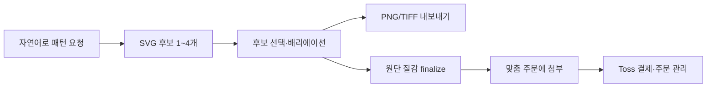
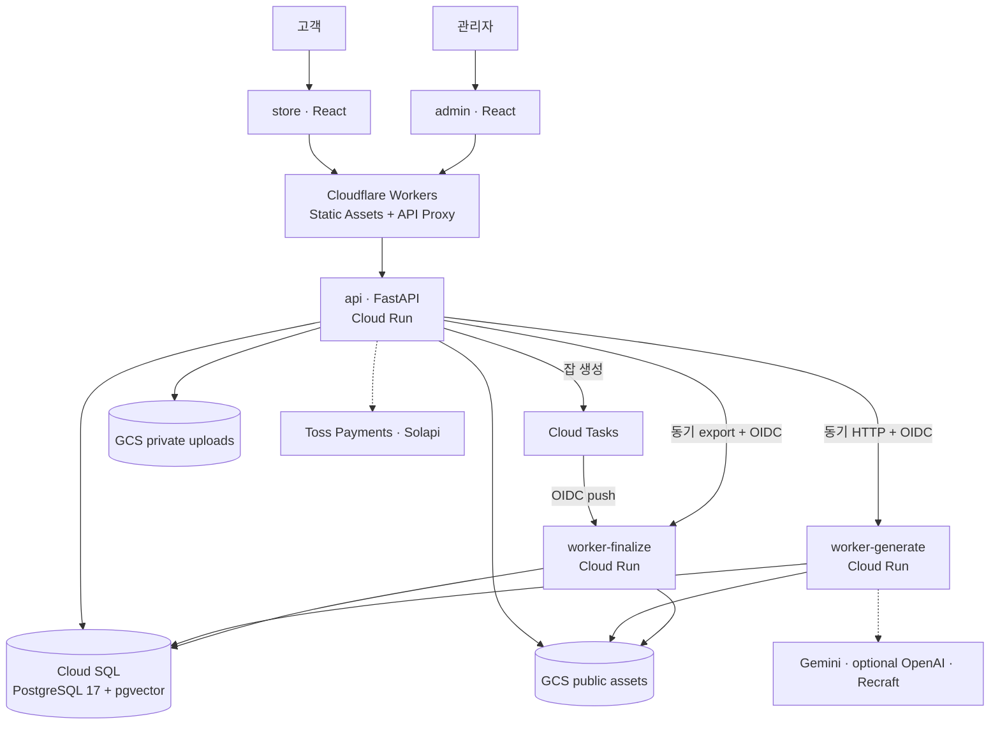

# ESSE SION

> 넥타이 커머스와 결정론적 seamless textile 엔진을 하나의 계약 중심 모노레포로 재설계한 프로젝트

**현재 상태:** 애플리케이션 구현·로컬 검증 완료 · 배포 자동화/IaC 구현 완료 · **스테이징 개통 전**


<p align="center"><sub>GPT Image로 제작한 포트폴리오 콘셉트 비주얼입니다. 실제 런타임 결과 화면은 아니며, 사용한 프롬프트는 <a href="./docs/assets/portfolio-hero.prompt.md">여기</a>에서 확인할 수 있습니다.</sub></p>

## 프로젝트 소개

ESSE SION은 기존 커머스 프론트엔드 **YeongSeon**과 독립 이미지 생성 서비스 **seamless-tile**을 통합해 처음부터 다시 구현한 cloud-native 커머스 플랫폼입니다.

기존 구조에서는 프론트엔드가 Supabase Auth·DB·Storage·Edge Functions에 직접 결합되어 있었고, 이미지 서비스의 장시간 생성 작업과 세션 상태는 단일 프로세스에 묶여 있었습니다. 새 구조는 다음 경계를 명확히 했습니다.

- 프론트엔드는 DB를 알지 못하며 OpenAPI에서 생성한 `packages/api-client`로만 통신합니다.
- 인증·인가·주문·결제·토큰 과금은 FastAPI `api`가 단일 소유합니다.
- Gemini가 자연어를 intent·motif spec으로 구조화하고 resolver가 catalog 재사용 또는 Recraft 생성을 결정합니다. concrete motif ID가 확정된 뒤의 배치·합성·seam은 결정론적 Python 엔진이 담당합니다.
- 즉시 응답이 필요한 generate와 무거운 fabric finalize를 별도 Cloud Run 서비스로 분리합니다.
- Supabase 런타임 의존성을 제거하고 PostgreSQL·GCS·GCP IAM 경계로 재설계했습니다.

코드는 기존 저장소에서 이식하지 않고 새로 작성했으며, 도메인 의미와 핵심 동작 계약은 테스트와 매핑 문서로 보존했습니다.

## 결과 요약

| 영역 | 구현 결과 |
|---|---|
| 계약 | OpenAPI **128 paths / 147 operations**, TypeScript SDK·TanStack Query 옵션·Zod 스키마 자동 생성, CI drift 차단 |
| 품질 | Python 651 + Vitest 311 = **962 tests passed**, Ruff·Pyright·Biome·빌드·타입 검사 통과 (2026-07-13 로컬 검증) |
| 이미지 엔진 | 25개 intent 골든, 대표 seed·candidate 변형, 대표 compose의 `PYTHONHASHSEED=0/1/12345` 교차 검증으로 byte-identical SVG 계약 보호 |
| 데이터 | SQLAlchemy 모델을 정본으로 두고 모든 스키마 변경을 Alembic으로 관리, 실제 PostgreSQL 기반 인가·동시성 테스트 |
| 운영 경계 | Cloudflare exact-secret, Cloud Run OIDC, Cloud Tasks 멱등 잡, 공개/비공개 GCS 버킷 분리, WIF 배포 파이프라인 구현 |

최신 전체 검증 기록은 [2026-07 리팩터링 감사](./docs/reviews/repo-refactor-2026-07.md)에서 확인할 수 있습니다.

## 사용자 경험



### Store

- 상품 탐색·상세, 게스트/회원 장바구니, 쿠폰, 배송지
- 일반·수선·맞춤·샘플 주문과 Toss 결제
- 토큰 구매·원장·환불, 주문·클레임·문의·견적·마이페이지
- 자연어 패턴 생성, 후보 선택, 세션 복구, PNG/TIFF export, 원단 finalize
- 반응형 UI, 접근성·200% zoom·reduced motion 검증

### Admin

- 대시보드, 주문·상품·쿠폰·견적·클레임·고객·문의 관리
- 맞춤 단가·설정 관리, 생성 작업·로그·모티프 운영
- 결제 인시던트 대사와 관리자 복구 흐름
- 관리자/매니저 역할 게이트와 감사 가능한 mutation 경계

### Design engine

- `prompt → intent → motif resolution → deterministic SVG` 파이프라인
- lattice·path-following·scatter·point-set 배치와 torus 좌표계
- scope·exact match·선택적 pgvector 유사도 검색으로 catalog를 우선 재사용하고, 유효 후보가 없거나 유사도 기준에 못 미치면 Recraft로 생성
- Pillow + librsvg 기반 preview·PNG/TIFF export·직조 질감 합성
- content hash와 create-only 업로드를 통한 재시도 안전성

## 아키텍처



프론트는 Vite로 빌드한 정적 자산을 Wrangler로 Cloudflare Workers에 배포합니다. API와 두 worker는 Cloud Run, DB는 Cloud SQL PostgreSQL, finalize 전달은 Cloud Tasks가 담당합니다. 현재 이 구성은 코드·OpenTofu·GitHub Actions까지 구현되어 있으며 실제 스테이징 리소스 개통은 남아 있습니다.

자세한 설계, 신뢰 경계, 장애 복구 방식과 ADR은 [ARCHITECTURE.md](./ARCHITECTURE.md)를 참고하세요.

## 핵심 설계 결정

1. **API 계약을 단일 정본으로 사용**

   FastAPI OpenAPI에서 프론트 SDK·쿼리 옵션·런타임 스키마를 생성합니다. API 스펙이 바뀌면 `pnpm codegen` 결과를 함께 커밋해야 하며 CI가 drift를 차단합니다.

2. **AI 판단과 출력 보장을 분리**

   prompt authoring은 탐색적이어도, resolved intent 이후에는 seeded RNG·정렬·canonical hash만 사용합니다. 같은 resolved intent·seed·colorway·엔진/레지스트리 버전은 같은 SVG를 만듭니다.

3. **부하 성격에 따라 worker를 분리**

   외부 API 대기가 긴 generate는 동기 UX로 유지하고, CPU·메모리를 많이 쓰는 finalize는 Cloud Tasks로 비동기화합니다. 두 서비스는 같은 코드베이스를 사용하되 라우트·IAM·리소스 프로필이 다릅니다.

4. **돈 경로는 API가 단독 소유**

   주문 생성, 쿠폰 예약, Toss 승인/취소 대사, 토큰 차감·환불을 DB 트랜잭션과 advisory lock 아래 처리합니다. provider key·금액·상태를 재검증해 중복 콜백과 웹훅에 안전하게 수렴합니다.

5. **재시도를 정상 흐름으로 설계**

   finalize task 이름은 job UUID로 고정하고, worker는 lease·attempt 조건부 갱신을 사용합니다. GCS에는 `if_generation_match=0`으로 생성해 다른 바이트의 덮어쓰기를 금지합니다.

6. **공개 결과와 고객 첨부를 물리적으로 분리**

   생성 preview·상품 이미지는 public assets 버킷, 수선·견적·주문 첨부는 private uploads 버킷에 둡니다. 완성 디자인을 주문에 쓸 때는 API가 public→private로 create-only 복사합니다.

## 기술 스택

| 영역 | 기술 |
|---|---|
| Frontend | React 19, TypeScript 6, Vite 8, React Router 8, TanStack Query 5, Zustand, Zod, Tailwind CSS 4 |
| Design system | `packages/shared`, semantic tokens, dependency-free primitives/components, Vitest drift guards |
| API | Python 3.13, FastAPI, Pydantic, SQLAlchemy 2 async, asyncpg, Authlib, JWT/Argon2 |
| Image pipeline | Deterministic Python engine, Pillow, librsvg, pgvector, Gemini, optional OpenAI embeddings, Recraft |
| Data | PostgreSQL 17 + pgvector, Alembic, testcontainers |
| Cloud | Cloudflare Workers, Cloud Run, Cloud Tasks, Cloud Scheduler, Cloud SQL, GCS, Secret Manager |
| Tooling | pnpm 10, Turborepo 2, uv, mise, Biome, Ruff, Pyright, Playwright, Schemathesis |
| Delivery | GitHub Actions, OpenTofu, Workload Identity Federation, Artifact Registry |

## 모노레포 구조

```text
essesion/
├── apps/
│   ├── store/          # 고객용 커머스·디자인 React 앱
│   ├── admin/          # 운영자 React 앱
│   ├── api/            # 인증·도메인·결제·과금 FastAPI
│   └── worker/         # generate/finalize 공용 이미지 엔진
├── packages/
│   ├── api-client/     # OpenAPI 생성 SDK·Query·Zod
│   ├── shared/         # 디자인 토큰·공용 UI
│   └── tsconfig/
├── libs/               # Python 공용 observability·SVG safety
├── db/                 # SQLAlchemy 모델·Alembic·이관 스크립트
├── infra/              # OpenTofu·Cloudflare 설정
├── e2e/                # Store 돈 경로·Admin smoke
└── docs/               # 명세·계획·감사·운영 문서
```

## 로컬 실행

### 준비물

- Node.js 22, pnpm 10
- Python 3.13, uv
- Docker
- worker 렌더링용 `rsvg-convert`(librsvg)
- 선택: `mise install`로 저장소의 툴체인 버전 설치

### 1. 의존성과 환경 변수

```bash
pnpm install --frozen-lockfile
uv sync --all-packages
cp .env.example .env
cp apps/store/.env.example apps/store/.env
cp apps/admin/.env.example apps/admin/.env
```

`apps/store/.env`의 `VITE_TOSS_CLIENT_KEY`에는 Toss 공개 테스트 client key를 입력합니다. 시크릿은 커밋하지 않습니다.

### 2. PostgreSQL과 스키마

```bash
docker compose up -d
uv run alembic -c db/alembic.ini upgrade head
uv run python apps/api/scripts/seed.py
```

### 3. 개발 서버

각 명령은 별도 터미널에서 실행합니다.

```bash
uv run uvicorn api.main:app --reload
uv run uvicorn worker.main:app --reload --port 8001
pnpm --filter store dev
pnpm --filter admin dev
```

로컬에서 Toss·Solapi·GCS 자격증명이 없으면 API는 해당 연동을 DryRun으로 실행합니다. 자연어 authoring에는 Gemini 키가 필요하고 OpenAI embedding은 선택 사항이며, catalog miss에서 새 motif를 만들려면 Recraft 키가 필요합니다. 결정론 엔진과 골든 테스트는 외부 호출 없이 검증할 수 있습니다. Cloud Tasks 없이 finalize 전체 흐름을 확인하려면 로컬 `.env`에 `WORKER_FINALIZE_INLINE=true`를 설정합니다.

## 검증

환경 파일을 채운 뒤 저장소 루트에서 실행합니다.

```bash
pnpm codegen
pnpm lint
pnpm turbo build typecheck test

uv run pytest
uv run ruff check .
uv run ruff format --check .
uv run pyright
```

돈 경로와 관리자 흐름의 브라우저 smoke는 실제 로컬 PostgreSQL을 사용합니다.

```bash
pnpm test:e2e
```

## 현재 상태와 다음 단계

완료된 범위:

- Store·Admin·API·worker·DB 마이그레이션 구현
- Supabase 신규 런타임 의존 제거와 OpenAPI client 전환
- 로컬 통합 테스트·브라우저 smoke·CI/CD·OpenTofu 구성
- Google·Kakao OAuth 코드 경로, 결제·문자·GCS의 local DryRun 경계

실제 공개 전 남은 작업:

- 스테이징 GCP/OpenTofu apply, Cloudflare DNS·WAF·route 개통
- Secret Manager·Sentry DSN·외부 provider 자격증명 연결
- Google·Kakao redirect, Toss·Solapi·Cloud Tasks OIDC 실연동 리허설
- Apple·Naver OAuth 구현
- 운영 데이터 변환 검증과 개인정보 보존·익명화 정책 승인
- 프로덕션 컷오버·롤백 리허설 후 기존 Supabase 해지

진행 상태는 [실행 체크리스트](./docs/CHECKLIST.md), 실제 개통 순서는 [운영자 체크리스트](./docs/OPERATOR-CHECKLIST.md)에서 추적합니다.

## 문서

- [Architecture](./ARCHITECTURE.md) — 시스템 경계, 요청 흐름, 결정론, 장애 복구, ADR
- [Execution checklist](./docs/CHECKLIST.md) — 구현·리허설·컷오버 진행 상태
- [Operator checklist](./docs/OPERATOR-CHECKLIST.md) — GCP·Cloudflare·시크릿 개통 순서
- [Schema mapping](./db/MAPPING.md) — 기존 Supabase 도메인과 새 PostgreSQL 모델 매핑
- [Money path spec](./docs/api-spec/money.md) — 주문·쿠폰·결제·토큰 동작 계약
- [Worker pipeline spec](./docs/api-spec/worker-pipeline.md) — generate·finalize·export 계약
- [Repository audit](./docs/reviews/repo-refactor-2026-07.md) — 보안·동시성·공급망 감사와 검증 결과
