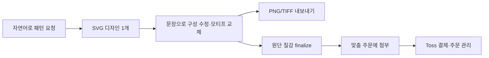
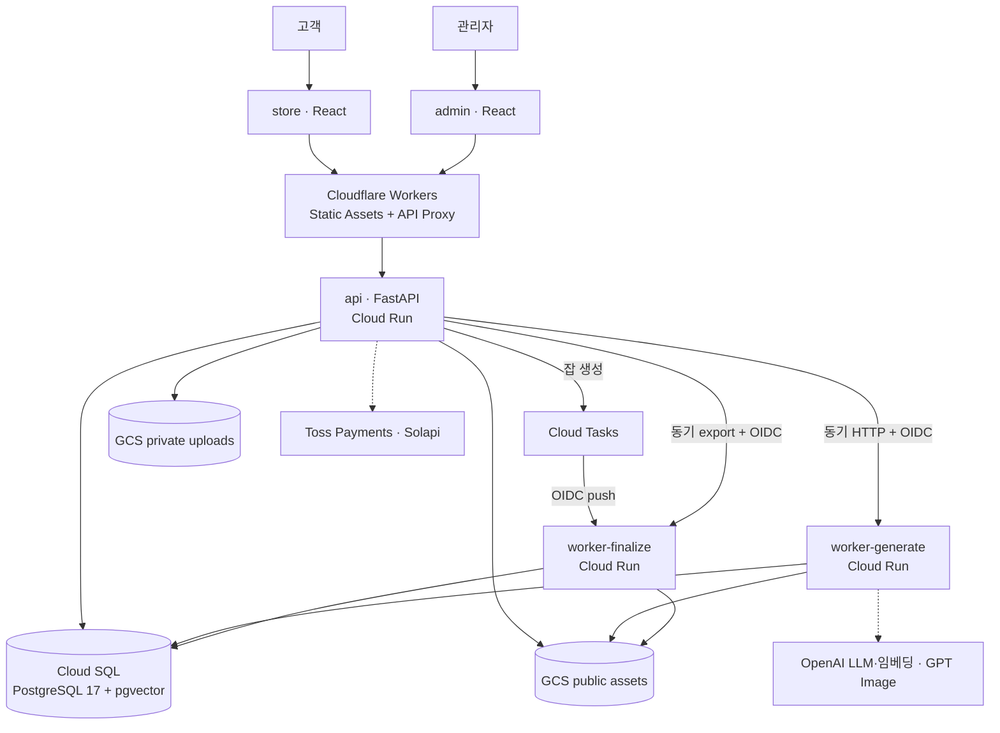

# ESSE SION

> 넥타이 커머스와 결정론적 seamless textile 엔진을 하나의 계약 중심 모노레포로 재설계한 프로젝트

**현재 상태:** 애플리케이션 구현·로컬 검증 완료 · **production 미개통**


<p align="center"><sub>GPT Image로 제작한 포트폴리오 콘셉트 비주얼입니다. 실제 런타임 결과 화면은 아니며, 사용한 프롬프트는 <a href="./docs/assets/portfolio-hero.prompt.md">여기</a>에서 확인할 수 있습니다.</sub></p>

## 프로젝트 소개

ESSE SION은 기존 커머스 프론트엔드 **YeongSeon**과 독립 이미지 생성 서비스 **seamless-tile**을 통합해 처음부터 다시 구현한 cloud-native 커머스 플랫폼입니다.

기존 구조에서는 프론트엔드가 Supabase Auth·DB·Storage·Edge Functions에 직접 결합되어 있었고, 이미지 서비스의 장시간 생성 작업과 세션 상태는 단일 프로세스에 묶여 있었습니다. 새 구조는 다음 경계를 명확히 했습니다.

- 프론트엔드는 DB를 알지 못하며 OpenAPI에서 생성한 `packages/api-client`로만 통신합니다.
- 인증·인가·주문·결제·토큰 과금은 FastAPI `api`가 단일 소유합니다.
- OpenAI LLM이 자연어를 typed design plan으로 구조화하고, 사용자가 명시적으로 요청한 새 모티프만 GPT Image 2 low와 로컬 VTracer로 생성합니다. concrete motif ID가 확정된 뒤의 배치·합성·seam은 결정론적 Python 엔진이 담당합니다.
- 즉시 응답이 필요한 generate와 무거운 fabric finalize를 별도 Cloud Run 서비스로 분리합니다.
- Supabase 런타임 의존성을 제거하고 PostgreSQL·GCS·GCP IAM 경계로 재설계했습니다.

코드는 기존 저장소에서 이식하지 않고 새로 작성했으며, 도메인 의미와 핵심 동작 계약은 테스트와 매핑 문서로 보존했습니다.

## 결과 요약

| 영역 | 구현 결과 |
|---|---|
| 계약 | OpenAPI **163 paths / 196 operations**, TypeScript SDK·TanStack Query 옵션·Zod 스키마 자동 생성, CI drift 차단 |
| 품질 | Python **1,238** + Vitest **518** 테스트, Ruff·Pyright·Biome·빌드·타입 검사·모듈 경계 gate (전체 실행은 CI가 정본, 2026-08-14 기준) |
| 이미지 엔진 | 25개 intent 골든, 대표 seed 변형, 대표 compose의 `PYTHONHASHSEED=0/1/12345` 교차 검증으로 byte-identical SVG 계약 보호 |
| 데이터 | SQLAlchemy 모델을 정본으로 두고 모든 스키마 변경을 Alembic으로 관리, 실제 PostgreSQL 기반 인가·동시성 테스트 |
| 운영 경계 | Cloudflare exact-secret, Cloud Run OIDC, Cloud Tasks 멱등 잡, 공개/비공개 GCS 버킷 분리, WIF 배포 파이프라인 구현 |

보안·동시성·공급망 감사 기록은 [2026-07 리팩터링 감사](./docs/reviews/repo-refactor-2026-07.md)에 있습니다.

## 사용자 경험


```mermaid
flowchart LR
    A[자연어로 패턴 요청] --> B[SVG 디자인 1개]
    B --> C[문장으로 구성 수정·모티프 교체]
    C --> D[PNG/TIFF 내보내기]
    C --> E[원단 질감 finalize]
    E --> F[맞춤 주문에 첨부]
    F --> G[Toss 결제·주문 관리]
```

### Store

- 상품 탐색·상세, 게스트/회원 장바구니, 쿠폰, 배송지
- 일반·수선·맞춤·샘플 주문과 Toss 결제
- 토큰 구매·원장·환불, 주문·클레임·문의·견적·마이페이지
- 자연어 패턴 생성, 문장 기반 구성 수정, 이력 되돌리기, PNG/TIFF export, 원단 finalize
- 반응형 UI, 접근성·200% zoom·reduced motion 검증

### Admin

- 대시보드, 주문·상품·쿠폰·견적·클레임·고객·문의 관리
- 맞춤 단가·설정 관리, 생성 작업·로그·모티프 운영
- 결제 인시던트 대사와 관리자 복구 흐름
- 관리자/매니저 역할 게이트와 감사 가능한 mutation 경계

### Design engine

- `prompt → intent → motif resolution → deterministic SVG` 파이프라인
- lattice·path-following·scatter·point-set 배치와 torus 좌표계
- exact token·pgvector 유사도 검색으로 승인된 catalog를 재사용하고, 모티프 모달의 명시적 요청만 GPT Image 2 low → 로컬 VTracer medium으로 생성
- Pillow + librsvg 기반 preview·PNG/TIFF export·직조 질감 합성
- content hash와 create-only 업로드를 통한 재시도 안전성

## 아키텍처


```mermaid
flowchart TB
    Customer[고객] --> Store[store · React]
    Operator[관리자] --> Admin[admin · React]
    Store --> Edge[Cloudflare Workers<br/>Static Assets + API Proxy]
    Admin --> Edge
    Edge --> API[api · FastAPI<br/>Cloud Run]

    API -->|동기 HTTP + OIDC| Generate[worker-generate<br/>Cloud Run]
    API -->|잡 생성| Tasks[Cloud Tasks]
    Tasks -->|OIDC push| Finalize[worker-finalize<br/>Cloud Run]
    API -->|동기 export + OIDC| Finalize

    API --> SQL[(Cloud SQL<br/>PostgreSQL 17 + pgvector)]
    Generate --> SQL
    Finalize --> SQL
    API --> Private[(GCS private uploads)]
    API --> Public[(GCS public assets)]
    Generate --> Public
    Finalize --> Public

    Generate -.-> AI[OpenAI LLM·임베딩 · GPT Image]
    API -.-> External[Toss Payments · Solapi]
```

프론트는 Vite로 빌드한 정적 자산을 Wrangler로 Cloudflare Workers에 배포합니다. API와 두 worker는 Cloud Run, DB는 Cloud SQL PostgreSQL, finalize 전달은 Cloud Tasks가 담당합니다. 별도 staging 프로젝트 없이 단일 production GCP 프로젝트만 운영합니다.

핵심 설계 결정 여섯 가지입니다.

- **API 계약이 단일 정본** — FastAPI OpenAPI에서 프론트 SDK·쿼리 옵션·런타임 스키마를 생성하고, CI가 drift를 차단합니다.
- **AI 판단과 출력 보장을 분리** — prompt authoring은 탐색적이어도 resolved intent 이후에는 seeded RNG·정렬·canonical hash만 사용합니다.
- **부하 성격에 따라 worker를 분리** — 대기가 긴 generate는 동기 UX, CPU·메모리를 쓰는 finalize는 Cloud Tasks 비동기. 같은 코드베이스에 라우트·IAM·리소스만 다릅니다.
- **돈 경로는 API가 단독 소유** — 주문·쿠폰·Toss 대사·토큰 원장을 DB 트랜잭션과 advisory lock 아래 처리하고 provider key·금액·상태를 재검증합니다.
- **재시도를 정상 흐름으로 설계** — finalize task 이름을 job UUID로 고정하고 lease·attempt 조건부 갱신과 `if_generation_match=0` 생성을 씁니다.
- **공개 결과와 고객 첨부를 물리적으로 분리** — public assets / private uploads 두 버킷을 두고, 완성 디자인을 주문에 쓸 때만 create-only 복사합니다.

각 결정의 근거와 기각한 대안, 신뢰 경계와 장애 복구 방식은 [ARCHITECTURE.md](./ARCHITECTURE.md)에 있습니다.

## 기술 스택

| 영역 | 기술 |
|---|---|
| Frontend | React 19, TypeScript 6, Vite 8, React Router 8, TanStack Query 5, Zod, Tailwind CSS 4 |
| Design system | `packages/shared`, semantic tokens, dependency-free primitives/components, Vitest drift guards |
| API | Python 3.13, FastAPI, Pydantic, SQLAlchemy 2 async, asyncpg, Authlib, JWT/Argon2 |
| Image pipeline | Deterministic Python engine, Pillow, librsvg, pgvector, OpenAI LLM/embeddings, GPT Image |
| Data | PostgreSQL 17 + pgvector, Alembic, testcontainers |
| Cloud | Cloudflare Workers, Cloud Run, Cloud Tasks, Cloud Scheduler, Cloud SQL, GCS, Secret Manager |
| Tooling | pnpm 10 workspaces, uv, mise, Biome, Ruff, Pyright, Playwright, Schemathesis |
| Delivery | GitHub Actions, OpenTofu, Workload Identity Federation, Artifact Registry |

## 모노레포 구조

```text
essesion/
├── apps/
│   ├── store/          # 고객용 커머스·디자인 React 앱
│   ├── admin/          # 운영자 React 앱
│   ├── api/            # 인증·도메인·결제·과금 FastAPI
│   └── worker/         # generate/finalize 공용 이미지 엔진
├── packages/
│   ├── api-client/     # OpenAPI 생성 SDK·Query·Zod
│   ├── shared/         # 디자인 토큰·공용 UI
│   └── tsconfig/
├── libs/               # Python 공용 observability·SVG safety
├── db/                 # SQLAlchemy 모델·Alembic
├── infra/              # OpenTofu·Cloudflare 설정
├── scripts/            # 아키텍처·문서 gate 하네스
├── e2e/                # Store 돈 경로·Admin smoke
└── docs/               # 명세·감사·운영 문서
```

## 로컬 실행

### 준비물

- Node.js 22, pnpm 10
- Python 3.13, uv
- Docker
- worker 렌더링용 `rsvg-convert`(librsvg)
- 선택: `mise install`로 저장소의 툴체인 버전 설치

### 1. 의존성과 환경 변수

```bash
pnpm install --frozen-lockfile
uv sync --all-packages
cp .env.example .env
cp apps/store/.env.example apps/store/.env
cp apps/admin/.env.example apps/admin/.env
```

`apps/store/.env`의 `VITE_TOSS_CLIENT_KEY`에는 Toss 공개 테스트 client key를 입력합니다. 시크릿은 커밋하지 않습니다.

### 2. PostgreSQL과 스키마

```bash
docker compose up -d --wait
uv run alembic -c db/alembic.ini upgrade head
uv run python apps/api/scripts/seed.py                      # 계정·가격·설정
uv run python apps/worker/scripts/seed_motifs.py            # 모티프 카탈로그
uv run python apps/worker/scripts/seed_design_examples.py   # 디자인 첫 진입 갤러리
```

시드는 전부 멱등이며 순서대로 실행해야 합니다. 뒤 두 개를 건너뛰면 `/design` 첫 진입이 빈 상태로 폴백합니다.

### 3. 개발 서버

각 명령은 별도 터미널에서 실행합니다.

```bash
uv run uvicorn api.main:app --reload
uv run uvicorn worker.main:app --reload --port 8001
pnpm --filter store dev
pnpm --filter admin dev
```

로컬에서 Toss·Solapi 자격증명이 없으면 API는 해당 연동을 DryRun으로 실행합니다. 파일 스토리지는 별도 설정 없이 `docker compose up -d`의 fake-gcs-server(`localhost:4443`, `dev-uploads`/`dev-assets`)를 사용하고, finalize는 Cloud Tasks 대신 로컬 worker 호출이 끝날 때까지 기다립니다. 자연어 authoring, 벡터 검색과 명시적 GPT Image 모티프 생성에는 `OPENAI_API_KEY`가 필요합니다(비우면 해당 경로 503/스킵). 결정론 엔진과 골든 테스트는 외부 호출 없이 검증할 수 있습니다. 배포 환경은 GCS 버킷이나 Cloud Tasks 설정이 빠지면 기동하지 않습니다.

## 검증

환경 파일을 채운 뒤 저장소 루트에서 실행합니다.

```bash
pnpm codegen                                    # 스펙 변경 시 생성물 drift 확인
pnpm lint
pnpm architecture:check                         # 모듈 경계·문서 링크
pnpm build && pnpm typecheck && pnpm test

uv run pytest
uv run ruff check .
uv run ruff format --check .
uv run pyright
```

돈 경로와 관리자 흐름의 브라우저 smoke는 실제 로컬 PostgreSQL을 사용합니다.

```bash
pnpm test:e2e
```

## 현재 상태와 다음 단계

완료된 범위:

- Store·Admin·API·worker·DB 마이그레이션 구현
- Supabase 신규 런타임 의존 제거와 OpenAPI client 전환
- 소셜 로그인 4종(Google·Kakao·Naver·Apple) 코드 경로
- 로컬 통합 테스트·브라우저 smoke·CI/CD·OpenTofu 구성
- 결제·문자 local DryRun과 GCS 로컬 에뮬레이터 경계

실제 공개 전 남은 작업:

- GCP/OpenTofu apply, Cloudflare DNS·WAF·route 개통
- Secret Manager·Sentry DSN·외부 provider 자격증명 연결
- 소셜 로그인 콘솔 등록·redirect(네이버는 이후 일정), Toss·Solapi·Cloud Tasks OIDC 실연동 확인
- 개인정보 보존·익명화 정책 승인 (컷오버 차단 gate)
- 프로덕션 컷오버·롤백 리허설 후 기존 Supabase 해지

진행 상태는 [실행 체크리스트](./docs/CHECKLIST.md), 개통 순서는 [운영자 체크리스트](./docs/OPERATOR-CHECKLIST.md)에서 추적합니다.

## 문서

| 문서 | 역할 |
|---|---|
| [ARCHITECTURE.md](./ARCHITECTURE.md) | 시스템 경계, 요청 흐름, 신뢰 경계, ADR |
| [docs/CHECKLIST.md](./docs/CHECKLIST.md) | 남은 작업 진행 상태 |
| [docs/OPERATOR-CHECKLIST.md](./docs/OPERATOR-CHECKLIST.md) | 개통 순서와 통과 판정 |
| [infra/README.md](./infra/README.md) | 개통 명령 정본 (gcloud·tofu·wrangler·시드) |
| [db/README.md](./db/README.md) | 스키마 규칙·마이그레이션·설계 의도 |
| [docs/api-spec/](./docs/api-spec/domains.md) | 도메인·돈 경로·worker 엔진/파이프라인/모티프 계약 |
| [docs/admin-ui-contract.md](./docs/admin-ui-contract.md) | admin 접근성·레이아웃 계약 |
| [packages/shared/AGENTS.md](./packages/shared/AGENTS.md) | 디자인 시스템 사용 규칙 |
| [AGENTS.md](./AGENTS.md) | 에이전트·기여자용 개발 하네스 |
